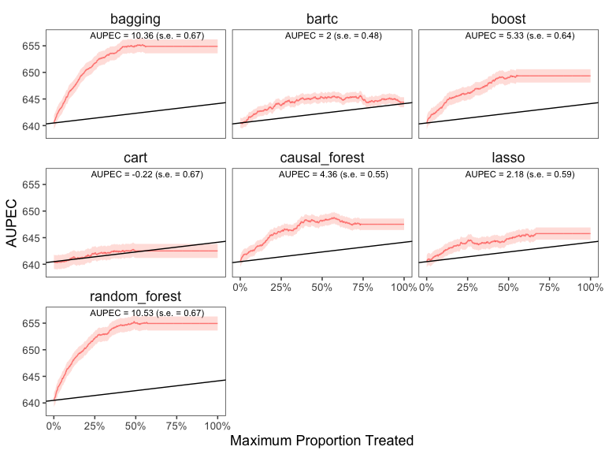

<!-- README.md is generated from README.Rmd. Please edit that file -->

# evalITR

<!-- badges: start -->
<!-- badges: end -->

## Installation

You can install the development version of evalITR from
[GitHub](https://github.com/) with:

``` r
# install.packages("devtools")
devtools::install_github("Michae/Applications/RStudio.app/Contents/Resources/app/quarto/bin/toolslLLi/evalITR")
```

(Optional) if you have multiple cores, we recommendate using
multisession futures and processing in parallel. This would increase
computation efficiency and reduce the time to fit the model.

``` r
library(furrr)
library(future.apply)

nworkers <- 4
plan(multisession, workers =nworkers)
```

## Example under cross-validation

This is an example using the `star` dataset (for more information about
the dataset, please use `?star`).

We first load the dataset and specify both outcome variables (reading,
math, and writing scores) and covariates we want to include in the
model. Then we use a series of machine learning algorithms to estimate
the heterogeneous effects of small classes on educational attainment. We
use 20% as a budget constraint and tuned the model through through the
3-fold cross validation.

``` r
library(tidyverse)
library(evalITR)

load("data/star.rda")

# specifying outcomes
outcomes <- c("g3tlangss")

# specifying covariates
covariates <-  star %>% 
                dplyr::select(-c("g3tlangss",
                "g3treadss","g3tmathss","treatment")) %>% 
                colnames()

# train the model
fit_cv <- run_itr(outcome = outcomes,
               treatment = "treatment",
               covariates = covariates,
               data = star,
               algorithms = c(
                  "causal_forest", 
                  # "bart",
                  "lasso",
                  "boost", 
                  "random_forest",
                  "bagging",
                  "cart"),
               plim = 0.2,
               n_folds = 3,
               ratio = 0)
#> Evaluate ITR with cross-validation ...
```

``` r
# compute estimates
est_cv <- estimate_itr(fit_cv)
```

``` r
# summarize estimates
summary(est_cv)
#> ── PAPE ────────────────────────────────────────────────────────────────────────
#>   estimate std.deviation     algorithm statistic p.value
#> 1     0.96          0.66 causal_forest       1.5  0.1422
#> 2     1.29          1.02         lasso       1.3  0.2064
#> 3     2.63          1.23         boost       2.1  0.0333
#> 4     2.21          0.85 random_forest       2.6  0.0093
#> 5     2.10          0.85       bagging       2.5  0.0136
#> 6    -0.63          0.89          cart      -0.7  0.4827
#> 
#> ── PAPEp ───────────────────────────────────────────────────────────────────────
#>   estimate std.deviation     algorithm statistic p.value
#> 1     2.39          0.70 causal_forest      3.40 0.00068
#> 2     1.04          0.64         lasso      1.61 0.10654
#> 3     1.21          0.66         boost      1.82 0.06836
#> 4     1.52          1.12 random_forest      1.35 0.17668
#> 5     0.72          0.89       bagging      0.82 0.41465
#> 6    -0.17          0.80          cart     -0.22 0.82862
#> 
#> ── PAPDp ───────────────────────────────────────────────────────────────────────
#>    estimate std.deviation                     algorithm statistic p.value
#> 1      1.36          1.00         causal_forest x lasso      1.36   0.173
#> 2      1.19          0.75         causal_forest x boost      1.58   0.114
#> 3      0.88          0.86 causal_forest x random_forest      1.02   0.307
#> 4      1.67          1.13       causal_forest x bagging      1.48   0.139
#> 5      2.57          0.97          causal_forest x cart      2.65   0.008
#> 6     -0.17          0.74                 lasso x boost     -0.23   0.822
#> 7     -0.48          0.80         lasso x random_forest     -0.59   0.552
#> 8      0.32          1.07               lasso x bagging      0.30   0.767
#> 9      1.21          0.91                  lasso x cart      1.33   0.182
#> 10    -0.31          0.73         boost x random_forest     -0.43   0.669
#> 11     0.48          0.70               boost x bagging      0.69   0.489
#> 12     1.38          0.94                  boost x cart      1.46   0.143
#> 13     0.79          0.84       random_forest x bagging      0.95   0.344
#> 14     1.69          1.21          random_forest x cart      1.39   0.164
#> 15     0.90          0.93                bagging x cart      0.97   0.333
#> 
#> ── AUPEC ───────────────────────────────────────────────────────────────────────
#>   estimate std.deviation     algorithm statistic p.value
#> 1      1.6          0.78 causal_forest      2.09   0.036
#> 2      1.2          1.00         lasso      1.21   0.227
#> 3      1.6          1.06         boost      1.54   0.124
#> 4      1.4          0.92 random_forest      1.50   0.134
#> 5      1.3          0.83       bagging      1.52   0.129
#> 6     -1.1          1.13          cart     -0.94   0.345
#> 
#> ── GATE ────────────────────────────────────────────────────────────────────────
#>    estimate std.deviation     algorithm group statistic p.value upper lower
#> 1     -56.1            66 causal_forest     1     -0.86   0.393  -104   112
#> 2      49.3            76 causal_forest     2      0.65   0.519  -122   129
#> 3      49.7            82 causal_forest     3      0.61   0.542  -131   138
#> 4     -37.0            59 causal_forest     4     -0.62   0.532   -94   101
#> 5      12.2           100 causal_forest     5      0.12   0.903  -161   168
#> 6     -88.1            90         lasso     1     -0.98   0.330  -145   152
#> 7       7.0            59         lasso     2      0.12   0.906   -94   101
#> 8      47.2            82         lasso     3      0.57   0.567  -132   139
#> 9      33.0            91         lasso     4      0.36   0.716  -146   153
#> 10     19.1           102         lasso     5      0.19   0.851  -164   171
#> 11    -17.5            70         boost     1     -0.25   0.803  -112   119
#> 12     -6.4            59         boost     2     -0.11   0.913   -93   101
#> 13     65.3            86         boost     3      0.76   0.446  -137   145
#> 14    -63.1            59         boost     4     -1.07   0.283   -93   100
#> 15     39.9            62         boost     5      0.64   0.522   -99   106
#> 16     22.5            99 random_forest     1      0.23   0.820  -159   166
#> 17    -37.5            59 random_forest     2     -0.64   0.524   -93   101
#> 18     27.5            59 random_forest     3      0.47   0.640   -93   100
#> 19     37.5           100 random_forest     4      0.38   0.708  -161   168
#> 20    -31.8            92 random_forest     5     -0.34   0.731  -148   156
#> 21    -13.1           102       bagging     1     -0.13   0.898  -164   172
#> 22    -41.2            91       bagging     2     -0.45   0.651  -146   153
#> 23    149.8            59       bagging     3      2.53   0.011   -94   101
#> 24    -55.1            89       bagging     4     -0.62   0.536  -143   150
#> 25    -22.3            83       bagging     5     -0.27   0.788  -133   140
#> 26    -38.3            99          cart     1     -0.39   0.698  -159   166
#> 27     79.3            59          cart     2      1.34   0.181   -94   101
#> 28    -16.9           101          cart     3     -0.17   0.868  -163   170
#> 29     14.2            75          cart     4      0.19   0.850  -120   127
#> 30    -20.2            59          cart     5     -0.34   0.732   -93   100
```

The`summary()` function displays the following summary statistics: (1)
population average prescriptive effect `PAPE`; (2) population average
prescriptive effect with a budget constraint `PAPEp`; (3) population
average prescriptive effect difference with a budget constraint `PAPDp`;
(4) and area under the prescriptive effect curve `AUPEC`. For more
information about these evaluation metrics, please refer to [this
paper](https://arxiv.org/abs/1905.05389).

We plot the estimated Area Under the Prescriptive Effect Curve for the
writing score across a range of budget constraints for different
algorithms.

``` r
# plot the AUPEC with different ML algorithms
plot(est_cv)
```


\## Example under sample splitting

Please set argument input of `n_folds` to 0 ion order to train the
models under sample splitting. The split ratio between train and test
set is determined by the `ratio` argument.

``` r
library(tidyverse)
library(evalITR)

load("data/star.rda")

# specifying outcomes
outcomes <- c("g3tlangss")

# specifying covariates
covariates <-  star %>% 
                dplyr::select(-c("g3tlangss",
                "g3treadss","g3tmathss","treatment")) %>% 
                colnames()

# estimate ITR 
fit <- run_itr(outcome = outcomes,
               treatment = "treatment",
               covariates = covariates,
               data = star,
               algorithms = c(
                  "causal_forest", 
                  "lasso",
                  "boost", 
                  "random_forest",
                  "bagging",
                  "cart"),
               plim = 0.2,
               ratio = 0.67)
#> Evaluate ITR under sample splitting ...
```

``` r
# compute estimates
est <- estimate_itr(fit)
```

``` r
# summarize estimates
summary(est)
#> ── PAPE ────────────────────────────────────────────────────────────────────────
#>   estimate std.deviation     algorithm statistic p.value
#> 1      4.3          0.74 causal_forest       5.8 7.0e-09
#> 2      2.1          0.78         lasso       2.7 7.8e-03
#> 3      6.0          0.80         boost       7.5 4.9e-14
#> 4     12.4          0.76 random_forest      16.4 3.6e-60
#> 5     12.4          0.76       bagging      16.4 2.7e-60
#> 6     -1.2          0.81          cart      -1.5 1.5e-01
#> 
#> ── PAPEp ───────────────────────────────────────────────────────────────────────
#>   estimate std.deviation     algorithm statistic p.value
#> 1     5.08          0.71 causal_forest      7.20 6.0e-13
#> 2     2.21          0.67         lasso      3.27 1.1e-03
#> 3     4.40          0.68         boost      6.42 1.3e-10
#> 4     8.71          0.69 random_forest     12.54 4.3e-36
#> 5     8.37          0.68       bagging     12.39 2.9e-35
#> 6    -0.33          0.64          cart     -0.51 6.1e-01
#> 
#> ── PAPDp ───────────────────────────────────────────────────────────────────────
#>    estimate std.deviation                     algorithm statistic p.value
#> 1      2.87          0.78         causal_forest x lasso      3.67 2.4e-04
#> 2      0.68          0.77         causal_forest x boost      0.89 3.8e-01
#> 3     -3.63          0.64 causal_forest x random_forest     -5.70 1.2e-08
#> 4     -3.30          0.72       causal_forest x bagging     -4.57 5.0e-06
#> 5      5.41          0.95          causal_forest x cart      5.68 1.4e-08
#> 6     -2.19          0.71                 lasso x boost     -3.07 2.1e-03
#> 7     -6.50          0.79         lasso x random_forest     -8.22 2.0e-16
#> 8     -6.17          0.80               lasso x bagging     -7.69 1.5e-14
#> 9      2.53          0.93                  lasso x cart      2.74 6.2e-03
#> 10    -4.31          0.68         boost x random_forest     -6.31 2.9e-10
#> 11    -3.98          0.69               boost x bagging     -5.75 9.2e-09
#> 12     4.73          0.96                  boost x cart      4.95 7.5e-07
#> 13     0.33          0.51       random_forest x bagging      0.66 5.1e-01
#> 14     9.04          0.94          random_forest x cart      9.62 6.4e-22
#> 15     8.70          0.91                bagging x cart      9.54 1.4e-21
#> 
#> ── AUPEC ───────────────────────────────────────────────────────────────────────
#>   estimate std.deviation     algorithm statistic p.value
#> 1      4.6          0.60 causal_forest       7.6 4.2e-14
#> 2      1.7          0.60         lasso       2.8 5.1e-03
#> 3      4.8          0.68         boost       7.1 1.4e-12
#> 4     10.2          0.69 random_forest      14.8 2.7e-49
#> 5     10.0          0.68       bagging      14.8 8.2e-50
#> 6     -1.3          0.65          cart      -2.1 4.0e-02
#> 
#> ── GATE ────────────────────────────────────────────────────────────────────────
#>    estimate std.deviation     algorithm group statistic p.value upper lower
#> 1       8.1            59 causal_forest     1     0.137   0.891   -94   101
#> 2     -23.5            59 causal_forest     2    -0.401   0.688   -93   100
#> 3    -106.9            59 causal_forest     3    -1.819   0.069   -93   100
#> 4     104.6            59 causal_forest     4     1.764   0.078   -94   101
#> 5      36.0            59 causal_forest     5     0.609   0.543   -94   101
#> 6     -28.9            59         lasso     1    -0.489   0.625   -94   101
#> 7      71.8            59         lasso     2     1.214   0.225   -94   101
#> 8     -31.1            59         lasso     3    -0.527   0.598   -94   101
#> 9     -42.5            59         lasso     4    -0.720   0.471   -94   101
#> 10     49.1            59         lasso     5     0.838   0.402   -93   100
#> 11    -18.8            59         boost     1    -0.319   0.749   -93   100
#> 12      1.0            59         boost     2     0.017   0.986   -94   101
#> 13    -49.4            59         boost     3    -0.839   0.402   -93   101
#> 14     66.0            59         boost     4     1.116   0.264   -94   101
#> 15     19.4            59         boost     5     0.329   0.742   -93   101
#> 16     10.3            59 random_forest     1     0.174   0.862   -94   101
#> 17   -116.1            58 random_forest     2    -1.987   0.047   -92   100
#> 18     -2.8            59 random_forest     3    -0.048   0.962   -93   101
#> 19     38.5            59 random_forest     4     0.652   0.515   -93   101
#> 20     88.4            59 random_forest     5     1.488   0.137   -94   101
#> 21    -29.2            59       bagging     1    -0.496   0.620   -93   100
#> 22    -41.4            59       bagging     2    -0.703   0.482   -93   100
#> 23      2.3            59       bagging     3     0.039   0.969   -93   101
#> 24     47.1            59       bagging     4     0.796   0.426   -94   101
#> 25     39.4            59       bagging     5     0.668   0.504   -93   101
#> 26     44.4            59          cart     1     0.753   0.451   -93   101
#> 27     15.4            59          cart     2     0.261   0.794   -93   101
#> 28     42.8            59          cart     3     0.721   0.471   -94   101
#> 29     34.4            59          cart     4     0.584   0.559   -93   101
#> 30   -118.8            59          cart     5    -2.024   0.043   -93   100
```

``` r
# plot the AUPEC with different ML algorithms
plot(est)
```


