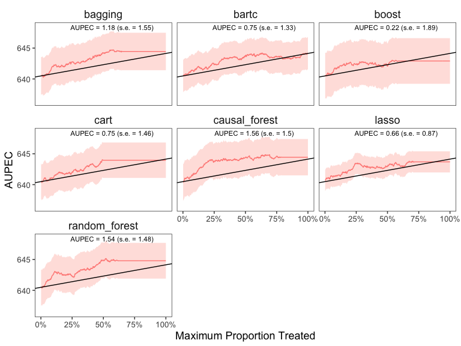

<!-- README.md is generated from README.Rmd. Please edit that file -->

# evalITR

<!-- badges: start -->
<!-- badges: end -->

## Installation

You can install the development version of evalITR from
[GitHub](https://github.com/) with:

``` r
# install.packages("devtools")
devtools::install_github("MichaelLLi/evalITR")
```

(Optional) if you have multiple cores, we recommendate using
multisession futures and processing in parallel. This would increase
computation efficiency and reduce the time to fit the model.

``` r
library(furrr)
library(future.apply)

nworkers <- 4
plan(multisession, workers =nworkers)
```

## Example (cross-validation)

This is an example using the `star` dataset (for more information about
the dataset, please use `?star`).

We first load the dataset and specify both outcome variables (reading,
math, and writing scores) and covariates we want to include in the
model. Then we use a series of machine learning algorithms to estimate
the heterogeneous effects of small classes on educational attainment. We
use 20% as a budget constraint and tuned the model through through the
3-fold cross validation.

``` r
library(tidyverse)
library(evalITR)

load("data/star.rda")

# specifying outcomes
outcomes <- c("g3tlangss",
                "g3treadss","g3tmathss")


# specifying covariates
covariates <-  star %>% 
                dplyr::select(-c(all_of(outcomes),"treatment")) %>% 
                colnames()

# estimate ITR 
fit <- run_itr(outcome = outcomes,
               treatment = "treatment",
               covariates = covariates,
               data = star,
               algorithms = c(
                  "causal_forest", 
                  "bart",
                  "lasso",
                  "boost", 
                  "random_forest",
                  "bagging",
                  "cart"),
               plim = 0.2,
               n_folds = 3)
```

The`summary()` function displays the following summary statistics: (1)
population average prescriptive effect `PAPE`; (2) population average
prescriptive effect with a budget constraint `PAPEp`; (3) population
average prescriptive effect difference with a budget constraint `PAPDp`;
(4) and area under the prescriptive effect curve `AUPEC`. For more
information about these evaluation metrics, please refer to [this
paper](https://arxiv.org/abs/1905.05389).

``` r
# summarize estimates
summary(fit)
#> ── PAPE ────────────────────────────────────────────────────────────────────────
#>   estimate std.deviation     algorithm statistic p.value
#> 1     0.65          1.69 causal_forest      0.38   0.702
#> 2     1.80          1.09          bart      1.65   0.099
#> 3     2.02          1.08         lasso      1.88   0.061
#> 4     0.61          0.83         boost      0.74   0.462
#> 5     1.97          1.28 random_forest      1.55   0.122
#> 6     1.18          0.84       bagging      1.40   0.161
#> 7     1.59          1.82          cart      0.88   0.381
#> 
#> ── PAPEp ───────────────────────────────────────────────────────────────────────
#>   estimate std.deviation     algorithm statistic p.value
#> 1     1.26          1.08 causal_forest      1.16   0.245
#> 2     1.14          0.65          bart      1.77   0.077
#> 3     0.74          1.07         lasso      0.69   0.487
#> 4     1.67          0.66         boost      2.54   0.011
#> 5     0.79          0.68 random_forest      1.17   0.243
#> 6     0.46          0.69       bagging      0.67   0.501
#> 7     0.87          0.66          cart      1.31   0.191
#> 
#> ── PAPDp ───────────────────────────────────────────────────────────────────────
#>    estimate std.deviation                     algorithm statistic p.value
#> 1     0.116          0.55          causal_forest x bart     0.211    0.83
#> 2     0.515          1.30         causal_forest x lasso     0.396    0.69
#> 3    -0.410          0.96         causal_forest x boost    -0.427    0.67
#> 4     0.465          0.79 causal_forest x random_forest     0.593    0.55
#> 5     0.794          0.85       causal_forest x bagging     0.930    0.35
#> 6     0.391          1.19          causal_forest x cart     0.329    0.74
#> 7     0.399          0.76                  bart x lasso     0.526    0.60
#> 8    -0.526          1.46                  bart x boost    -0.361    0.72
#> 9     0.350          1.13          bart x random_forest     0.310    0.76
#> 10    0.678          1.42                bart x bagging     0.478    0.63
#> 11    0.276          1.39                   bart x cart     0.199    0.84
#> 12   -0.925          0.76                 lasso x boost    -1.209    0.23
#> 13   -0.049          0.86         lasso x random_forest    -0.057    0.95
#> 14    0.279          0.85               lasso x bagging     0.327    0.74
#> 15   -0.123          1.16                  lasso x cart    -0.107    0.91
#> 16    0.875          0.77         boost x random_forest     1.140    0.25
#> 17    1.204          1.29               boost x bagging     0.935    0.35
#> 18    0.801          1.47                  boost x cart     0.544    0.59
#> 19    0.328          0.46       random_forest x bagging     0.708    0.48
#> 20   -0.074          0.86          random_forest x cart    -0.086    0.93
#> 21   -0.402          1.40                bagging x cart    -0.288    0.77
#> 
#> ── AUPEC ───────────────────────────────────────────────────────────────────────
#>   estimate std.deviation     algorithm statistic p.value
#> 1     1.06           2.3 causal_forest      0.46    0.65
#> 2     0.93           1.8          bart      0.51    0.61
#> 3     0.89           2.4         lasso      0.37    0.71
#> 4     0.39           1.6         boost      0.25    0.81
#> 5     1.04           2.2 random_forest      0.47    0.64
#> 6     0.47           2.5       bagging      0.19    0.85
#> 7     0.91           1.8          cart      0.51    0.61
```

We plot the estimated Area Under the Prescriptive Effect Curve for the
writing score across a range of budget constraints for different
algorithms.

``` r
# plot the AUPEC with different ML algorithms
plot(x = fit, 
      outcome = "g3tlangss",
      treatment = "treatment",
      data = star, 
      algorithms = c(
          "causal_forest",
          "bart",
          "lasso",
          "boost", 
          "random_forest",
          "bagging", 
          "cart"))
```



## Example under sample splitting (under development)

Please set argument input of `n_folds` to 0 in order to train the models under sample splitting. The split ratio between train and test set is determined by the `ratio` argument. 

```r
library(tidyverse)
library(evalITR)

load("data/star.rda")

# specifying outcomes
outcomes <- c("g3tlangss",
              "g3treadss",
              "g3tmathss")


# specifying covariates
covariates <-  star %>% 
                dplyr::select(-c(all_of(outcomes),"treatment")) %>% 
                colnames()

# estimate ITR 
fit <- run_itr(outcome = outcomes,
               treatment = "treatment",
               covariates = covariates,
               data = star,
               algorithms = c(
                  "causal_forest", 
                  "lasso",
                  "boost", 
                  "random_forest",
                  "bagging",
                  "cart"),
               plim = 0.2,
               n_folds = 0, # train under sample splitting
               ratio = 0.67) # set 0.67 as the split ratio between train and test set

glimpse(fit$qoi)

List of 6
#> $ PAPE  :List of 6
#>  ..$ :List of 3
#>  .. ..$ pape: num 5.12
#>  .. ..$ sd  : num 0.642
#>  .. ..$ alg : chr "causal_forest"
#>  ..$ :List of 3
#>  .. ..$ pape: num 2.72
#>  .. ..$ sd  : num 0.808
#>  .. ..$ alg : chr "lasso"
#>  ..$ :List of 3
#>  .. ..$ pape: num 8.28
#>  .. ..$ sd  : num 0.871
#>  .. ..$ alg : chr "boost"
#>  ..$ :List of 3
#>  .. ..$ pape: num 13.6
#>  .. ..$ sd  : num 0.835
#>  .. ..$ alg : chr "random_forest"
#>  ..$ :List of 3
#>  .. ..$ pape: num 13.8
#>  .. ..$ sd  : num 0.832
#>  .. ..$ alg : chr "bagging"
#>  ..$ :List of 3
#>  .. ..$ pape: num 0.421
#>  .. ..$ sd  : num 0.901
#>  .. ..$ alg : chr "cart"
#> $ PAPEp :List of 6
#>  ..$ :List of 3
#>  .. ..$ pape: num 5.04
#>  .. ..$ sd  : num 0.711
#>  .. ..$ alg : chr "causal_forest"
#>  ..$ :List of 3
#>  .. ..$ pape: num 2.79
#>  .. ..$ sd  : num 0.72
#>  .. ..$ alg : chr "lasso"
#>  ..$ :List of 3
#>  .. ..$ pape: num 5.51
#>  .. ..$ sd  : num 0.712
#>  .. ..$ alg : chr "boost"
#>  ..$ :List of 3
#>  .. ..$ pape: num 9.6
#>  .. ..$ sd  : num 0.678
#>  .. ..$ alg : chr "random_forest"
#>  ..$ :List of 3
#>  .. ..$ pape: num 9.53
#>  .. ..$ sd  : num 0.675
#>  .. ..$ alg : chr "bagging"
#>  ..$ :List of 3
#>  .. ..$ pape: num -0.148
#>  .. ..$ sd  : num 0.709
#>  .. ..$ alg : chr "cart"
#> $ PAPDp :List of 15
#>  ..$ :List of 3
#>  .. ..$ papd: num 2.25
#>  .. ..$ sd  : num 0.853
#>  .. ..$ alg : chr "causal_forest x lasso"
#>  ..$ :List of 3
#>  .. ..$ papd: num -0.471
#>  .. ..$ sd  : num 0.814
#>  .. ..$ alg : chr "causal_forest x boost"
#>  ..$ :List of 3
#>  .. ..$ papd: num -4.56
#>  .. ..$ sd  : num 0.706
#>  .. ..$ alg : chr "causal_forest x random_forest"
#>  ..$ :List of 3
#>  .. ..$ papd: num -4.49
#>  .. ..$ sd  : num 0.813
#>  .. ..$ alg : chr "causal_forest x bagging"
#>  ..$ :List of 3
#>  .. ..$ papd: num 5.19
#>  .. ..$ sd  : num 1.03
#>  .. ..$ alg : chr "causal_forest x cart"
#>  ..$ :List of 3
#>  .. ..$ papd: num -2.72
#>  .. ..$ sd  : num 0.866
#>  .. ..$ alg : chr "lasso x boost"
#>  ..$ :List of 3
#>  .. ..$ papd: num -6.81
#>  .. ..$ sd  : num 0.9
#>  .. ..$ alg : chr "lasso x random_forest"
#>  ..$ :List of 3
#>  .. ..$ papd: num -6.74
#>  .. ..$ sd  : num 0.898
#>  .. ..$ alg : chr "lasso x bagging"
#>  ..$ :List of 3
#>  .. ..$ papd: num 2.94
#>  .. ..$ sd  : num 1.04
#>  .. ..$ alg : chr "lasso x cart"
#>  ..$ :List of 3
#>  .. ..$ papd: num -4.09
#>  .. ..$ sd  : num 0.787
#>  .. ..$ alg : chr "boost x random_forest"
#>  ..$ :List of 3
#>  .. ..$ papd: num -4.02
#>  .. ..$ sd  : num 0.824
#>  .. ..$ alg : chr "boost x bagging"
#>  ..$ :List of 3
#>  .. ..$ papd: num 5.66
#>  .. ..$ sd  : num 1.02
#>  .. ..$ alg : chr "boost x cart"
#>  ..$ :List of 3
#>  .. ..$ papd: num 0.0753
#>  .. ..$ sd  : num 0.487
#>  .. ..$ alg : chr "random_forest x bagging"
#>  ..$ :List of 3
#>  .. ..$ papd: num 9.75
#>  .. ..$ sd  : num 0.954
#>  .. ..$ alg : chr "random_forest x cart"
#>  ..$ :List of 3
#>  .. ..$ papd: num 9.68
#>  .. ..$ sd  : num 0.977
#>  .. ..$ alg : chr "bagging x cart"
#> $ AUPEC :List of 6
#>  ..$ :List of 3
#>  .. ..$ aupec: num 5.65
#>  .. ..$ sd   : num 0.583
#>  .. ..$ vec  : num [1:1911] -2.69 -2.69 -2.63 -2.68 -2.68 ...
#>  ..$ :List of 3
#>  .. ..$ aupec: num 2.58
#>  .. ..$ sd   : num 0.618
#>  .. ..$ vec  : num [1:1911] -2.63 -2.69 -2.69 -2.71 -2.75 ...
#>  ..$ :List of 3
#>  .. ..$ aupec: num 6.38
#>  .. ..$ sd   : num 0.705
#>  .. ..$ vec  : num [1:1911] -2.63 -2.56 -2.6 -2.61 -2.59 ...
#>  ..$ :List of 3
#>  .. ..$ aupec: num 11.1
#>  .. ..$ sd   : num 0.716
#>  .. ..$ vec  : num [1:1911] -2.63 -2.56 -2.47 -2.42 -2.39 ...
#>  ..$ :List of 3
#>  .. ..$ aupec: num 11.4
#>  .. ..$ sd   : num 0.716
#>  .. ..$ vec  : num [1:1911] -2.63 -2.56 -2.52 -2.42 -2.39 ...
#>  ..$ :List of 3
#>  .. ..$ aupec: num -0.475
#>  .. ..$ sd   : num 0.742
#>  .. ..$ vec  : num [1:1911] -2.75 -2.74 -2.73 -2.67 -2.67 ...
#> $ GATE  :List of 6
#>  ..$ :List of 4
#>  .. ..$ gate : num [1:5] -24.2 -81.8 79.6 -68.8 124
#>  .. ..$ sd   : num [1:5] 57.6 57.4 57.8 57.3 58
#>  .. ..$ alg  : chr "causal_forest"
#>  .. ..$ group: int [1:5] 1 2 3 4 5
#>  ..$ :List of 4
#>  .. ..$ gate : num [1:5] 12.03 -6.65 6.99 94.71 -78.2
#>  .. ..$ sd   : num [1:5] 57.5 57.8 57.9 57.6 57.5
#>  .. ..$ alg  : chr "lasso"
#>  .. ..$ group: int [1:5] 1 2 3 4 5
#>  ..$ :List of 4
#>  .. ..$ gate : num [1:5] -35.8 89.7 -48.7 55.6 -31.9
#>  .. ..$ sd   : num [1:5] 57.5 57.5 57.5 57.8 57.9
#>  .. ..$ alg  : chr "boost"
#>  .. ..$ group: int [1:5] 1 2 3 4 5
#>  ..$ :List of 4
#>  .. ..$ gate : num [1:5] -21.7 -76.4 42.8 16.7 67.5
#>  .. ..$ sd   : num [1:5] 57.6 57.2 57.4 57.4 58.5
#>  .. ..$ alg  : chr "random_forest"
#>  .. ..$ group: int [1:5] 1 2 3 4 5
#>  ..$ :List of 4
#>  .. ..$ gate : num [1:5] -58.1 -33.5 45.1 -24.5 99.9
#>  .. ..$ sd   : num [1:5] 57.5 57.4 57.4 57.2 58.6
#>  .. ..$ alg  : chr "bagging"
#>  .. ..$ group: int [1:5] 1 2 3 4 5
#>  ..$ :List of 4
#>  .. ..$ gate : num [1:5] 42.9 48.91 41.89 -103.68 -1.14
#>  .. ..$ sd   : num [1:5] 57.9 57.7 57.8 57.3 57.5
#>  .. ..$ alg  : chr "cart"
#>  .. ..$ group: int [1:5] 1 2 3 4 5
```
