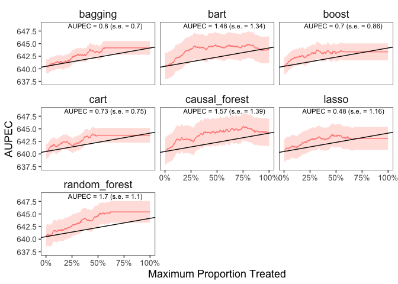

<!-- README.md is generated from README.Rmd. Please edit that file -->

# evalITR

<!-- badges: start -->
<!-- badges: end -->

## Installation

You can install the development version of evalITR from
[GitHub](https://github.com/) with:

``` r
# install.packages("devtools")
devtools::install_github("MichaelLLi/evalITR")
```

## Example

This is an example using the STAT dataset

``` r
library(tidyverse)
library(evalITR)

load("data/star.rda")

# specifying outcomes
outcomes <- c("g3tlangss",
                "g3treadss","g3tmathss")

# specifying covariates
covariates <-  star %>% 
                dplyr::select(-c(all_of(outcomes),"treatment")) %>% 
                colnames()

# estimate ITR 
fit <- run_itr(outcome = outcomes,
               treatment = "treatment",
               covariates = covariates,
               data = star,
               algorithms = c(
                  "causal_forest", 
                  "bart",
                  "lasso",
                  "boost", 
                  "random_forest",
                  "bagging",
                  "cart"),
               plim = 0.2,
               n_folds = 3)
```

``` r
# plot the AUPEC with different ML algorithms
plot_aupec(fit = fit$qoi[1], 
          outcome = outcomes[1],
          treatment = "treatment",
          data = star, 
          algorithms = c(
                  "causal_forest",
                  "bart",
                  "lasso",
                  "boost", 
                  "random_forest",
                  "bagging", 
                  "cart"))
```


