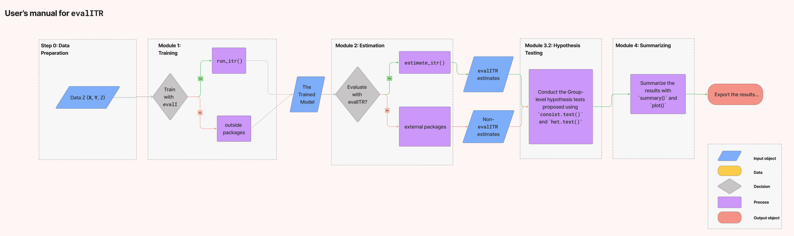
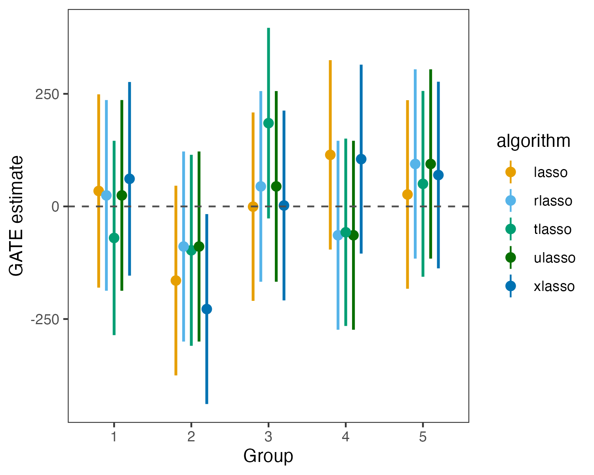
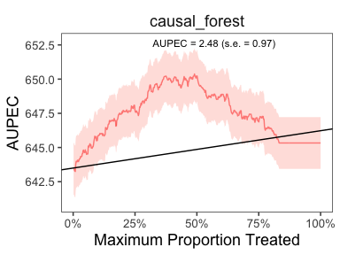
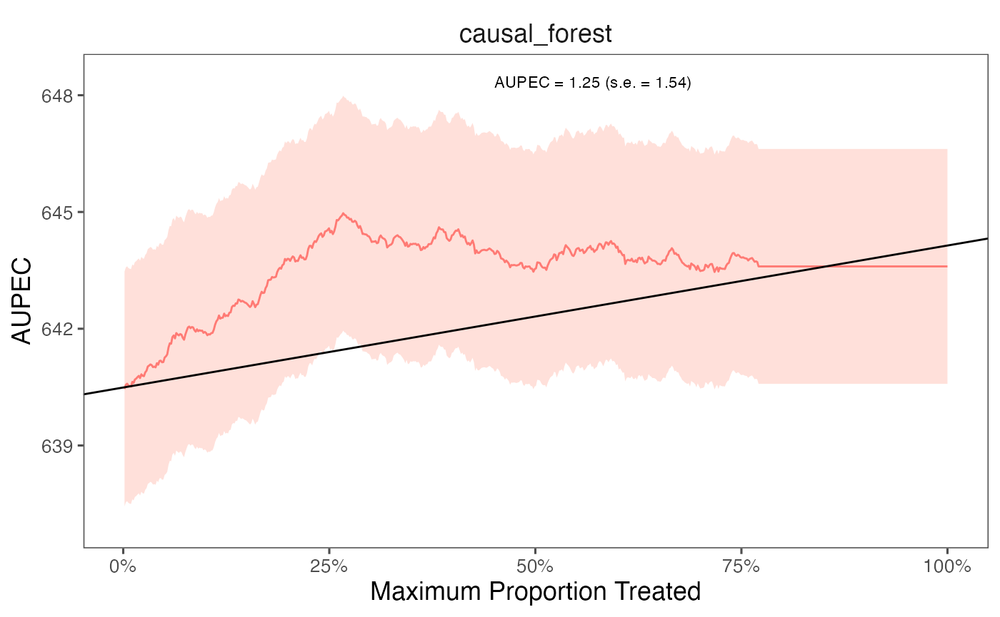
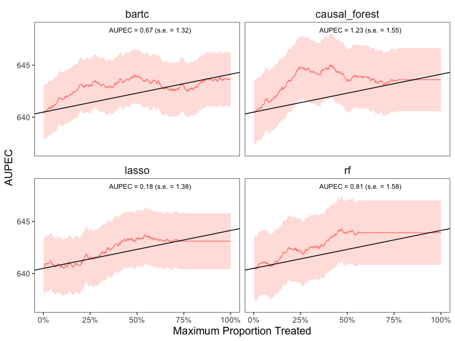

<!-- README.md is generated from README.Rmd. Please edit that file -->



# evalITR

<!-- badges: start -->
<!-- badges: end -->

## Installation

You can install the development version of evalITR from
[GitHub](https://github.com/) with:

``` r
# install.packages("devtools")
devtools::install_github("MichaelLLi/evalITR")
```

(Optional) if you have multiple cores, we recommendate using
multisession futures and processing in parallel. This would increase
computation efficiency and reduce the time to fit the model.

``` r
library(furrr)
library(future.apply)

nworkers <- 4
plan(multisession, workers =nworkers)
```

## Example under sample splitting

This is an example using the `star` dataset (for more information about
the dataset, please use `?star`).

We start with a simple example with one outcome variable (writing
scores) and one machine learning algorithm (causal forest). Then we move
to incoporate multiple outcomes and compare model performances with
several machine learning algorithms.

To begin, we load the dataset and specify the outcome variable and
covariates to be used in the model. Next, we utilize a random forest
algorithm to develop an Individualized Treatment Rule (ITR) for
estimating the varied impacts of small class sizes on students’ writing
scores. Since the treatment is often costly for most policy programs, we
consider a case with 20% budget constraint (`budget` = 0.2). The model
will identify the top 20% of units who benefit from the treatment most
and assign them to with the treatment. We train the model through sample
splitting, with the `split_ratio` between the train and test sets
determined by the `split_ratio` argument. Specifically, we allocate 70%
of the data to train the model, while the remaining 30% is used as
testing data (`split_ratio` = 0.7).

``` r
library(tidyverse)
library(evalITR)

load("data/star.rda")

# specifying the outcome
outcomes <- "g3tlangss"

# specifying the treatment
treatment <- "treatment"

# specifying covariates
covariates <-  star %>% dplyr::select(-c("g3tlangss",
                "g3treadss","g3tmathss","treatment")) %>% 
                colnames()

# specifying the data
star_data = star %>% dplyr::select(-c(g3treadss,g3tmathss))

# specifying the formula
user_formula <- as.formula(paste(paste0(outcomes)," ~ ", paste0(covariates, collapse = "+"), " + treatment"))


# estimate ITR 
fit <- estimate_itr(
               treatment = treatment,
               form = user_formula,
               data = star_data,
               algorithms = c("causal_forest"),
               budget = 0.2,
               split_ratio = 0.7)
#> Evaluate ITR under sample splitting ...


# evaluate ITR 
est <- evaluate_itr(fit)
#> Cannot compute PAPDp
```

Alternatively, we can train the model with the `caret` package (for
further information about `caret`, see
[caret](http://topepo.github.io/caret/index.html)).

``` r
# alternatively (with caret package)

# specify the trainControl method
fitControl <- caret::trainControl(## 3-fold CV
                           method = "repeatedcv",
                           number = 3,
                           ## repeated 3 times
                           repeats = 3)

# specify the tuning grid
gbmGrid <-  expand.grid(interaction.depth = c(1, 5, 9), 
                        n.trees = (1:30)*50, 
                        shrinkage = 0.1,
                        n.minobsinnode = 20)

# estimate ITR
fit_caret <- estimate_itr(
              treatment = "treatment",
              form = user_formula,
              trControl = fitControl,
              data = star_data,
              algorithms = c("gbm"),
              budget = 0.2,
              split_ratio = 0.7,
              tuneGrid = gbmGrid,
              verbose = FALSE)

# evaluate ITR
est_caret <- evaluate_itr(fit_caret)

# check the final model
est_caret$estimates$models$gbm$finalModel
```

The`summary()` function displays the following summary statistics: (1)
population average prescriptive effect `PAPE`; (2) population average
prescriptive effect with a budget constraint `PAPEp`; (3) population
average prescriptive effect difference with a budget constraint `PAPDp`.
This quantity will be computed with more than 2 machine learning
algorithms); (4) and area under the prescriptive effect curve `AUPEC`.
For more information about these evaluation metrics, please refer to
[Imai and Li (2021)](https://arxiv.org/abs/1905.05389); (5) Grouped
Average Treatment Effects `GATEs`. The details of the methods for this
design are given in [Imai and Li
(2022)](https://arxiv.org/abs/2203.14511).

``` r
# summarize estimates
summary(est)
#> ── PAPE ────────────────────────────────────────────────────────────────────────
#>   estimate std.deviation     algorithm statistic p.value
#> 1        3           1.4 causal_forest       2.2   0.026
#> 
#> ── PAPEp ───────────────────────────────────────────────────────────────────────
#>   estimate std.deviation     algorithm statistic p.value
#> 1      2.4           1.2 causal_forest       2.1   0.038
#> 
#> ── PAPDp ───────────────────────────────────────────────────────────────────────
#> data frame with 0 columns and 0 rows
#> 
#> ── AUPEC ───────────────────────────────────────────────────────────────────────
#>   estimate std.deviation     algorithm statistic p.value
#> 1      2.7             1 causal_forest       2.7  0.0076
#> 
#> ── GATE ────────────────────────────────────────────────────────────────────────
#>   estimate std.deviation     algorithm group statistic p.value upper lower
#> 1   -143.3           108 causal_forest     1    -1.327    0.18  -321    34
#> 2     28.7           108 causal_forest     2     0.265    0.79  -149   207
#> 3      6.6           108 causal_forest     3     0.061    0.95  -171   184
#> 4    127.0           108 causal_forest     4     1.177    0.24   -51   305
#> 5     21.0           107 causal_forest     5     0.196    0.84  -155   197

# similarly for caret
# summary(est_caret)
```

We can extract estimates from the `est` object. The following code shows
how to extract the GATE estimates for the writing score with `rlasso`
and `lasso` algorithms.

``` r
# plot GATE estimates
summary(est)$GATE %>% 
  mutate(group = as_factor(group)) %>%
  ggplot(., aes(
    x = group, y = estimate,
    ymin = lower , ymax = upper, color = algorithm)) +
  ggdist::geom_pointinterval(
    width=0.5,    
    position=position_dodge(0.5),
    interval_size_range = c(0.8, 1.5),
    fatten_point = 2.5) +
  theme_bw() +    
  theme(panel.grid = element_blank(),
        panel.background = element_blank()) +
  labs(x = "Group", y = "GATE estimate") +
  geom_hline(yintercept = 0, linetype = "dashed", color = "#4e4e4e") +
  scale_color_manual(values = c("#E69F00", "#56B4E9", "#009E73", "#076f00", "#0072B2")) 
```



We plot the estimated Area Under the Prescriptive Effect Curve for the
writing score across a range of budget constraints for causal forest.

``` r
# plot the AUPEC 
plot(est)
```



``` r

# plot the AUPEC for the model trained using caret
# plot(est_caret)
```

## Example under cross-validation

The package also allows estimate ITR with k-folds cross-validation.
Instead of specifying the `split_ratio` argument, we choose the number
of folds (`n_folds`). The following code presents an example of
estimating ITR with 3 folds cross-validation. In practice, we recommend
using 10 folds to get a more stable model performance.

``` r
# estimate ITR 
set.seed(2021)
fit_cv <- estimate_itr(
               treatment = treatment,
               form = user_formula,
               data = star_data,
               trcontrol = fitControl,
               algorithms = c("causal_forest"),
               budget = 0.2,
               n_folds = 3)
#> Evaluate ITR with cross-validation ...

# evaluate ITR 
est_cv <- evaluate_itr(fit_cv)
#> Cannot compute PAPDp

# summarize estimates
summary(est_cv)
#> ── PAPE ────────────────────────────────────────────────────────────────────────
#>   estimate std.deviation     algorithm statistic p.value
#> 1     0.49          0.91 causal_forest      0.54    0.59
#> 
#> ── PAPEp ───────────────────────────────────────────────────────────────────────
#>   estimate std.deviation     algorithm statistic p.value
#> 1      2.6          0.76 causal_forest       3.4   6e-04
#> 
#> ── PAPDp ───────────────────────────────────────────────────────────────────────
#> data frame with 0 columns and 0 rows
#> 
#> ── AUPEC ───────────────────────────────────────────────────────────────────────
#>   estimate std.deviation     algorithm statistic p.value
#> 1      1.2           1.5 causal_forest      0.81    0.42
#> 
#> ── GATE ────────────────────────────────────────────────────────────────────────
#>   estimate std.deviation     algorithm group statistic p.value upper lower
#> 1      -85            59 causal_forest     1     -1.45    0.15    30  -201
#> 2       40            59 causal_forest     2      0.68    0.50   157   -76
#> 3       29            59 causal_forest     3      0.50    0.62   145   -86
#> 4       13            59 causal_forest     4      0.22    0.82   129  -103
#> 5       21           102 causal_forest     5      0.20    0.84   220  -179

# plot the AUPEC 
plot(est_cv)
```

<!-- -->

## Example with multiple ML algorithms

We can estimate ITR with various machine learning algorithms and then
compare the performance of each model. The package includes all ML
algorithms in the `caret` package and 2 additional algorithms ([causal
forest](https://grf-labs.github.io/grf/reference/causal_forest.html) and
[bartCause](https://cran.r-project.org/web/packages/bartCause/index.html)).

The package also allows estimate heterogeneous treatment effects on the
individual and group-level. On the individual-level, the summary
statistics and the AUPEC plot show whether assigning individualized
treatment rules may outperform complete random experiment. On the
group-level, we specify the number of groups through `ngates` and
estimating heterogeneous treatment effects across groups.

``` r
# specify the trainControl method
fitControl <- caret::trainControl(
                           method = "repeatedcv",
                           number = 3,
                           repeats = 3)
# estimate ITR
set.seed(2021)
fit_cv <- estimate_itr(
               treatment = "treatment",
               form = user_formula,
               data = star_data,
               trControl = fitControl,
               algorithms = c(
                  "causal_forest", 
                  "bartc",
                  "lasso", # from caret package
                  "rf"), 
               budget = 0.2,
               n_folds = 3)
#> Evaluate ITR with cross-validation ...
#> fitting treatment model via method 'bart'
#> fitting response model via method 'bart'
#> fitting treatment model via method 'bart'
#> fitting response model via method 'bart'
#> fitting treatment model via method 'bart'
#> fitting response model via method 'bart'

# evaluate ITR
est_cv <- evaluate_itr(fit_cv)

# summarize estimates
summary(est_cv)
#> ── PAPE ────────────────────────────────────────────────────────────────────────
#>   estimate std.deviation     algorithm statistic p.value
#> 1     0.95          0.82 causal_forest      1.17    0.24
#> 2    -0.34          0.39         bartc     -0.88    0.38
#> 3     0.17          1.07         lasso      0.16    0.87
#> 4     1.27          0.95            rf      1.33    0.18
#> 
#> ── PAPEp ───────────────────────────────────────────────────────────────────────
#>   estimate std.deviation     algorithm statistic p.value
#> 1     2.55          0.65 causal_forest      3.91 9.2e-05
#> 2     1.55          0.90         bartc      1.72 8.6e-02
#> 3    -0.21          0.63         lasso     -0.33 7.4e-01
#> 4     1.69          1.11            rf      1.52 1.3e-01
#> 
#> ── PAPDp ───────────────────────────────────────────────────────────────────────
#>   estimate std.deviation             algorithm statistic p.value
#> 1     1.00          0.90 causal_forest x bartc      1.12 0.26457
#> 2     2.76          0.80 causal_forest x lasso      3.46 0.00054
#> 3     0.87          0.71    causal_forest x rf      1.22 0.22292
#> 4     1.76          1.11         bartc x lasso      1.59 0.11276
#> 5    -0.13          1.13            bartc x rf     -0.12 0.90651
#> 6    -1.89          0.72            lasso x rf     -2.62 0.00892
#> 
#> ── AUPEC ───────────────────────────────────────────────────────────────────────
#>   estimate std.deviation     algorithm statistic p.value
#> 1     1.43           1.5 causal_forest      0.92    0.36
#> 2     0.75           1.4         bartc      0.53    0.59
#> 3     0.18           1.4         lasso      0.13    0.90
#> 4     1.37           1.6            rf      0.88    0.38
#> 
#> ── GATE ────────────────────────────────────────────────────────────────────────
#>    estimate std.deviation     algorithm group statistic p.value upper lower
#> 1    -118.1            59 causal_forest     1    -2.013   0.044  -3.1  -233
#> 2      27.0            59 causal_forest     2     0.454   0.650 143.5   -90
#> 3      60.9            59 causal_forest     3     1.034   0.301 176.4   -55
#> 4       7.6            59 causal_forest     4     0.128   0.898 123.7  -109
#> 5      40.9            99 causal_forest     5     0.411   0.681 235.8  -154
#> 6       5.9            82         bartc     1     0.072   0.943 166.7  -155
#> 7     -91.4            59         bartc     2    -1.547   0.122  24.4  -207
#> 8     -19.1            96         bartc     3    -0.199   0.842 168.7  -207
#> 9      53.8            89         bartc     4     0.603   0.547 228.9  -121
#> 10     69.0            89         bartc     5     0.776   0.438 243.3  -105
#> 11    -14.4            94         lasso     1    -0.154   0.878 169.2  -198
#> 12    -94.5            90         lasso     2    -1.051   0.293  81.8  -271
#> 13     87.9            99         lasso     3     0.886   0.376 282.4  -107
#> 14     12.6            59         lasso     4     0.214   0.830 127.8  -103
#> 15     26.6            59         lasso     5     0.451   0.652 142.4   -89
#> 16    -37.4            59            rf     1    -0.638   0.523  77.5  -152
#> 17     10.6            59            rf     2     0.180   0.857 126.5  -105
#> 18    -17.6            59            rf     3    -0.299   0.765  97.7  -133
#> 19     66.5            86            rf     4     0.770   0.441 235.9  -103
#> 20     -3.9            60            rf     5    -0.066   0.948 113.0  -121
```

We plot the estimated Area Under the Prescriptive Effect Curve for the
writing score across different ML algorithms.

``` r
# plot the AUPEC with different ML algorithms
plot(est_cv)
```



For caret models, we can extract the training model and check the model
performance.

``` r
# extract the caret model
fit$estimates$models$rf %>% 
  ggplot() + theme_bw() 
```


