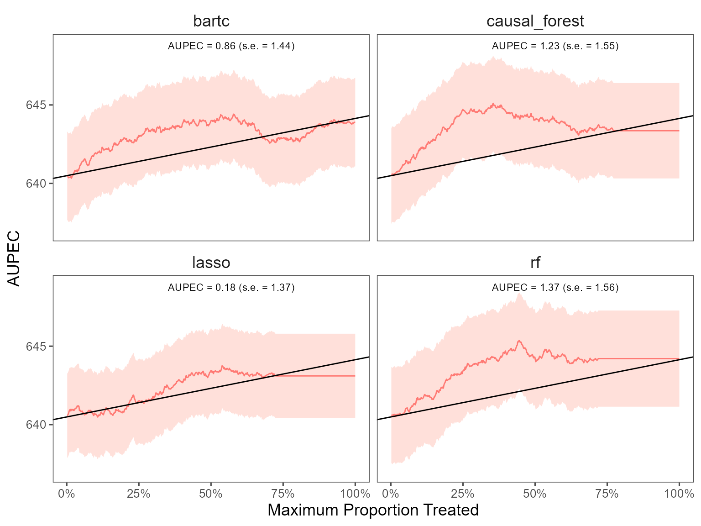

<!-- README.md is generated from README.Rmd. Please edit that file -->

# evalITR

<!-- badges: start -->
<!-- badges: end -->

## Installation

You can install the development version of evalITR from
[GitHub](https://github.com/) with:

``` r
# install.packages("devtools")
devtools::install_github("MichaelLLi/evalITR")
```

(Optional) if you have multiple cores, we recommendate using
multisession futures and processing in parallel. This would increase
computation efficiency and reduce the time to fit the model.

``` r
library(furrr)
library(future.apply)

nworkers <- 4
plan(multisession, workers =nworkers)
```

## Example under sample splitting

This is an example using the `star` dataset (for more information about
the dataset, please use `?star`).

We start with a simple example with one outcome variable (writing
scores) and one machine learning algorithm (causal forest). Then we move
to incoporate multiple outcomes and compare model performances with
several machine learning algorithms.

To begin, we load the dataset and specify the outcome variable and
covariates to be used in the model. Next, we utilize a random forest
algorithm to develop an Individualized Treatment Rule (ITR) for
estimating the varied impacts of small class sizes on students’ writing
scores. Since the treatment is often costly for most policy programs, we
consider a case with 20% budget constraint (`plim` = 0.2). The model
will identify the top 20% of units who benefit from the treatment most
and assign them to with the treatment. We train the model through sample
splitting, with the `ratio` between the train and test sets determined
by the ratio argument. Specifically, we allocate 70% of the data to
train the model, while the remaining 30% is used as testing data (`ratio`
= 0.7).

``` r
library(tidyverse)
library(evalITR)

load("data/star.rda")

# specifying the outcome
outcomes <- "g3tlangss"

# specifying the treatment
treatment <- "treatment"

# specifying covariates
covariates <-  star %>% dplyr::select(-c("g3tlangss",
                "g3treadss","g3tmathss","treatment")) %>% 
                colnames()

# estimate ITR 
fit <- run_itr(outcome = outcomes,
               treatment = treatment,
               covariates = covariates,
               data = star,
               algorithms = c("causal_forest"),
               plim = 0.2,
               ratio = 0.7)

# evaluate ITR 
est <- estimate_itr(fit)
```

The `summary()` function displays the following summary statistics: (1)
population average prescriptive effect `PAPE`; (2) population average
prescriptive effect with a budget constraint `PAPEp`; (3) population
average prescriptive effect difference with a budget constraint `PAPDp`.
This quantity will be computed with more than 2 machine learning
algorithms); (4) and area under the prescriptive effect curve `AUPEC`.
For more information about these evaluation metrics, please refer to
[Imai and Li (2021)](https://arxiv.org/abs/1905.05389); (5) Grouped
Average Treatment Effects `GATEs`. The details of the methods for this
design are given in [Imai and Li
(2021)](https://arxiv.org/abs/2203.14511).

``` r
# summarize estimates
summary(est)
#> ── PAPE ────────────────────────────────────────────────────────────────────────
#>   estimate std.deviation     algorithm statistic p.value
#> 1     0.94           1.3 causal_forest      0.74    0.46
#> 
#> ── PAPEp ───────────────────────────────────────────────────────────────────────
#>   estimate std.deviation     algorithm statistic p.value
#> 1      3.1           1.2 causal_forest       2.5   0.012
#> 
#> ── PAPDp ───────────────────────────────────────────────────────────────────────
#> data frame with 0 columns and 0 rows
#> 
#> ── AUPEC ───────────────────────────────────────────────────────────────────────
#>   estimate std.deviation     algorithm statistic p.value
#> 1      1.6             1 causal_forest       1.6    0.11
#> 
#> ── GATE ────────────────────────────────────────────────────────────────────────
#>   estimate std.deviation     algorithm group statistic p.value upper lower
#> 1    152.7           109 causal_forest     1     1.399   0.162  -173   185
#> 2   -178.0           108 causal_forest     2    -1.649   0.099  -171   184
#> 3    150.4           109 causal_forest     3     1.375   0.169  -174   186
#> 4    -99.5           107 causal_forest     4    -0.930   0.352  -170   182
#> 5      4.6           108 causal_forest     5     0.043   0.966  -171   183
```

We plot the estimated Area Under the Prescriptive Effect Curve for the
writing score across a range of budget constraints for causal forest.

``` r
# plot the AUPEC 
plot(est)
```


## Example under cross-validation

The package also allows estimate ITR with k-folds cross-validation.
Instead of specifying the `ratio` argument, we choose the number of
folds (`n_folds`). The following code presents an example of estimating
ITR with 3 folds cross-validation. In practice, we recommend using 10
folds to get a more stable model performance.

``` r
# estimate ITR 
fit_cv <- run_itr(outcome = outcomes,
               treatment = treatment,
               covariates = covariates,
               data = star,
               algorithms = c("causal_forest"),
               plim = 0.2,
               n_folds = 3)

# evaluate ITR 
est_cv <- estimate_itr(fit_cv)
```

We present the results with 3-folds cross validation and plot the AUPEC.

``` r
# summarize estimates
summary(est_cv)
#> ── PAPE ────────────────────────────────────────────────────────────────────────
#>   estimate std.deviation     algorithm statistic p.value
#> 1    0.019             1 causal_forest     0.018    0.99
#> 
#> ── PAPEp ───────────────────────────────────────────────────────────────────────
#>   estimate std.deviation     algorithm statistic p.value
#> 1      1.7           1.1 causal_forest       1.7   0.099
#> 
#> ── PAPDp ───────────────────────────────────────────────────────────────────────
#> data frame with 0 columns and 0 rows
#> 
#> ── AUPEC ───────────────────────────────────────────────────────────────────────
#>   estimate std.deviation     algorithm statistic p.value
#> 1     0.95          0.99 causal_forest      0.96    0.34
#> 
#> ── GATE ────────────────────────────────────────────────────────────────────────
#>   estimate std.deviation     algorithm group statistic p.value upper lower
#> 1    -75.1            59 causal_forest     1     -1.27    0.20   -93   101
#> 2     58.3           100 causal_forest     2      0.58    0.56  -161   169
#> 3      9.3            83 causal_forest     3      0.11    0.91  -132   140
#> 4    -37.4            59 causal_forest     4     -0.63    0.53   -93   101
#> 5     63.1            72 causal_forest     5      0.87    0.38  -115   123
```

``` r
# plot the AUPEC 
plot(est_cv)
```


## Example with multiple ML algorithms/outcomes

We can estimate ITR with various machine learning algorithms and then
compare the performance of each model. The package includes 7 different
ML algorithms (causal forest, BART, lasso, boosting trees, random
forest, CART, bagging trees).

The package also allows estimate heterogeneous treatment effects on the
individual and group-level. On the individual-level, the summary
statistics and the AUPEC plot show whether assigning individualized
treatment rules may outperform complete random experiment. On the
group-level, we specify the number of groups through `ngates` and
estimating heterogeneous treatment effects across groups.

If the original experiment has diverse outcome measures, we develop ITRs
for each outcome and use them to estimate the heterogeneous effects
across the different outcomes.

``` r
# specifying outcomes
outcomes <- c("g3tlangss","g3treadss","g3tmathss")

# specifying covariates
covariates <-  star %>% dplyr::select(-c("g3tlangss","g3treadss","g3tmathss","treatment")) %>% 
                colnames()

# train the model
fit_cv <- run_itr(outcome = outcomes,
               treatment = "treatment",
               covariates = covariates,
               data = star,
               algorithms = c(
                  "causal_forest", 
                  # "bartc",
                  "lasso",
                  "boost", 
                  "random_forest",
                  "cart",
                  "bagging"),
               plim = 0.2,
               n_folds = 3)
```

``` r
# compute estimates
est_cv <- estimate_itr(fit_cv)
```

``` r
# summarize estimates
summary(est_cv, outcome = "g3tlangss")
#> ── PAPE ────────────────────────────────────────────────────────────────────────
#>   estimate std.deviation     algorithm statistic p.value
#> 1      1.8          0.79 causal_forest       2.3  0.0243
#> 2      1.2          1.15         lasso       1.0  0.3167
#> 3      1.7          1.15         boost       1.4  0.1503
#> 4      3.1          1.15 random_forest       2.7  0.0069
#> 5      1.3          0.92          cart       1.4  0.1714
#> 6      2.7          1.25       bagging       2.2  0.0307
#> 
#> ── PAPEp ───────────────────────────────────────────────────────────────────────
#>   estimate std.deviation     algorithm statistic p.value
#> 1     3.51          0.72 causal_forest      4.91 9.2e-07
#> 2     1.17          1.07         lasso      1.09 2.7e-01
#> 3     2.78          1.02         boost      2.72 6.6e-03
#> 4     2.82          1.06 random_forest      2.67 7.5e-03
#> 5     0.69          1.06          cart      0.65 5.1e-01
#> 6     2.28          1.17       bagging      1.96 5.1e-02
#> 
#> ── PAPDp ───────────────────────────────────────────────────────────────────────
#>    estimate std.deviation                     algorithm statistic p.value
#> 1     2.342          1.29         causal_forest x lasso     1.817   0.069
#> 2     0.733          1.36         causal_forest x boost     0.540   0.589
#> 3     0.694          0.68 causal_forest x random_forest     1.025   0.305
#> 4     2.823          1.46          causal_forest x cart     1.933   0.053
#> 5     1.236          0.84       causal_forest x bagging     1.463   0.143
#> 6    -1.609          1.30                 lasso x boost    -1.235   0.217
#> 7    -1.648          1.30         lasso x random_forest    -1.265   0.206
#> 8     0.481          1.61                  lasso x cart     0.298   0.766
#> 9    -1.106          1.41               lasso x bagging    -0.787   0.431
#> 10   -0.039          0.80         boost x random_forest    -0.049   0.961
#> 11    2.090          1.50                  boost x cart     1.391   0.164
#> 12    0.504          1.00               boost x bagging     0.505   0.613
#> 13    2.129          1.39          random_forest x cart     1.536   0.125
#> 14    0.543          0.82       random_forest x bagging     0.664   0.506
#> 15   -1.587          1.49                cart x bagging    -1.064   0.287
#> 
#> ── AUPEC ───────────────────────────────────────────────────────────────────────
#>   estimate std.deviation     algorithm statistic p.value
#> 1     2.14          1.31 causal_forest      1.63    0.10
#> 2     1.11          1.27         lasso      0.88    0.38
#> 3     1.56          0.67         boost      2.32    0.02
#> 4     2.21          1.56 random_forest      1.42    0.16
#> 5     0.49          1.70          cart      0.29    0.77
#> 6     1.88          1.33       bagging      1.42    0.16
#> 
#> ── GATE ────────────────────────────────────────────────────────────────────────
#>    estimate std.deviation     algorithm group statistic p.value upper lower
#> 1      15.6            59 causal_forest     1     0.264    0.79   -94   101
#> 2     -35.5            72 causal_forest     2    -0.491    0.62  -115   123
#> 3    -102.6            66 causal_forest     3    -1.563    0.12  -104   111
#> 4      27.4           103 causal_forest     4     0.267    0.79  -165   172
#> 5     112.8            78 causal_forest     5     1.442    0.15  -125   132
#> 6     -14.5           103         lasso     1    -0.141    0.89  -166   173
#> 7     -11.2            63         lasso     2    -0.178    0.86  -100   107
#> 8      17.4            84         lasso     3     0.208    0.84  -134   142
#> 9      46.6            86         lasso     4     0.545    0.59  -137   144
#> 10    -20.5            59         lasso     5    -0.348    0.73   -93   100
#> 11    -27.8            92         boost     1    -0.304    0.76  -147   154
#> 12     12.3            59         boost     2     0.210    0.83   -93   100
#> 13    -48.6            92         boost     3    -0.530    0.60  -147   154
#> 14    114.3           103         boost     4     1.109    0.27  -166   173
#> 15    -32.4            59         boost     5    -0.549    0.58   -94   101
#> 16    -12.5            59 random_forest     1    -0.212    0.83   -93   100
#> 17     12.8            59 random_forest     2     0.216    0.83   -94   101
#> 18      4.4            99 random_forest     3     0.045    0.96  -159   166
#> 19      5.2            89 random_forest     4     0.058    0.95  -143   150
#> 20      7.8            84 random_forest     5     0.093    0.93  -134   141
#> 21    -16.2            79          cart     1    -0.206    0.84  -126   133
#> 22     39.1            95          cart     2     0.412    0.68  -153   160
#> 23      3.5            59          cart     3     0.060    0.95   -93   100
#> 24    -13.0            59          cart     4    -0.219    0.83   -94   101
#> 25      4.4            67          cart     5     0.065    0.95  -107   115
#> 26     14.0            59       bagging     1     0.237    0.81   -94   101
#> 27    -17.7            59       bagging     2    -0.299    0.76   -94   101
#> 28     28.2            96       bagging     3     0.295    0.77  -154   161
#> 29    -53.0            84       bagging     4    -0.634    0.53  -134   141
#> 30     46.2            74       bagging     5     0.626    0.53  -118   125
```

We plot the estimated Area Under the Prescriptive Effect Curve for the
writing score across different ML algorithms.

``` r
# plot the AUPEC with different ML algorithms
plot(est_cv, outcome = "g3tlangss")
```


