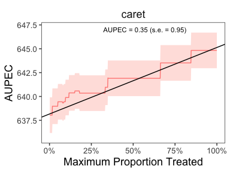

<!-- README.md is generated from README.Rmd. Please edit that file -->

# evalITR: Estimation and Evaluation Methods for Individualized Treatment Rules

<!-- badges: start -->


<!-- badges: end -->

This R package enables researchers to make statistical inference with
any learning algorithm to estimate and validate individualized treatment
rules with experimental data. The package is modularized and integrates
with various state-of-the-art machine learning packages. It allows
parameter tuning and provides original ITR evaluation metrics as well as
hypothesis testing. Users will be able to complete the entire workflow
of analysis i.e., training, estimation, and validation in one step.
Computation of various summary statistics and plotting functionality are
also included.

## Installation Instructions

You can install the development version of ‘evalITR’ from
[GitHub](https://github.com/) with:

``` r
# install.packages("devtools")
devtools::install_github("xiaolong-y/evalITR@causal-ml")
#> Skipping install of 'evalITR' from a github remote, the SHA1 (a15c9f22) has not changed since last install.
#>   Use `force = TRUE` to force installation
```

(Optional) if you have multiple cores, we recommend using multisession
futures and processing in parallel. This would increase computation
efficiency and reduce the time to fit the model.

``` r
library(furrr)
#> Loading required package: future
library(future.apply)

nworkers <- 4
plan(multisession, workers =nworkers)
```

## Getting started

### Example under sample splitting

This is an example using the `star` dataset (for more information about
the dataset, please use `?star`).

We start with a simple example with one outcome variable (writing
scores) and one machine learning algorithm (causal forest). Then we move
to incoporate multiple outcomes and compare model performances with
several machine learning algorithms.

To begin, we load the dataset and specify the outcome variable and
covariates to be used in the model. Next, we utilize a random forest
algorithm to develop an Individualized Treatment Rule (ITR) for
estimating the varied impacts of small class sizes on students’ writing
scores. Since the treatment is often costly for most policy programs, we
consider a case with 20% budget constraint (`budget` = 0.2). The model
will identify the top 20% of units who benefit from the treatment most
and assign them to with the treatment. We train the model through sample
splitting, with the `ratio` between the train and test sets determined
by the ratio argument. Specifically, we allocate 70% of the data to
train the model, while the remaining 30% is used as testing data
(`ratio` = 0.7).

``` r
library(tidyverse)
library(evalITR)

load("data/star.rda")

# specifying the outcome
outcomes <- "g3tlangss"

# specifying the treatment
treatment <- "treatment"

# specifying covariates
covariates <-  star %>% dplyr::select(-c("g3tlangss",
                "g3treadss","g3tmathss","treatment")) %>% 
                colnames()

# specifying the data
star_data = star %>% dplyr::select(-c(g3treadss,g3tmathss))

# estimate ITR 
set.seed(2021)
fit <- estimate_itr(outcome = outcomes,
               treatment = treatment,
               covariates = covariates,
               data = star_data,
               algorithms = c(
                  "causal_forest", 
                  # "bartc",
                  # "svm",
                  "lasso",
                  "boost", 
                  "random_forest",
                  "cart",
                  "bagging"),
               budget = 0.2,
               ratio = 0.7,
               n_folds = 7)
#> Evaluate ITR under sample splitting ...


# evaluate ITR 
est <- evaluate_itr(fit)
```

Alternatively, we can train the model with the `caret` package (for
further information about `caret`, see
[caret](http://topepo.github.io/caret/index.html)).

``` r
# alternatively (with caret package)
fit_caret <- estimate_itr(outcome = outcomes,
               treatment = treatment,
               covariates = covariates,
               data = star_data,
               algorithms = c("caret"),
               budget = 0.2,
               ratio = 0.7,
               trainControl_method = "repeatedcv", # resampling method
               train_method = "gbm", # model
               preProcess = NULL, # pre-processing predictors
               tuneGrid = NULL, # tuning values
               tuneLength = 1, # granularity in tuning
               number = 3, # number of folds/resampling iterations
               repeats = 3)
#> Evaluate ITR under sample splitting ...


est_caret <- evaluate_itr(fit_caret)
#> Cannot compute PAPDp
```

The`summary()` function displays the following summary statistics: (1)
population average prescriptive effect `PAPE`; (2) population average
prescriptive effect with a budget constraint `PAPEp`; (3) population
average prescriptive effect difference with a budget constraint `PAPDp`.
This quantity will be computed with more than 2 machine learning
algorithms); (4) and area under the prescriptive effect curve `AUPEC`.
For more information about these evaluation metrics, please refer to
[Imai and Li (2021)](https://arxiv.org/abs/1905.05389); (5) Grouped
Average Treatment Effects `GATEs`. The details of the methods for this
design are given in [Imai and Li
(2022)](https://arxiv.org/abs/2203.14511).

``` r
# summarize estimates
summary(est)
#> ── PAPE ────────────────────────────────────────────────────────────────────────
#>   estimate std.deviation     algorithm statistic p.value
#> 1    0.780           1.4 causal_forest     0.575    0.57
#> 2   -0.900           1.4         lasso    -0.626    0.53
#> 3   -0.789           1.5         boost    -0.537    0.59
#> 4    0.565           1.5 random_forest     0.384    0.70
#> 5   -0.756           1.5          cart    -0.513    0.61
#> 6    0.098           1.5       bagging     0.066    0.95
#> 
#> ── PAPEp ───────────────────────────────────────────────────────────────────────
#>   estimate std.deviation     algorithm statistic p.value
#> 1    2.776           1.2 causal_forest    2.2523   0.024
#> 2    0.571           1.1         lasso    0.5269   0.598
#> 3    0.348           1.1         boost    0.3129   0.754
#> 4    0.013           1.3 random_forest    0.0099   0.992
#> 5   -0.241           1.1          cart   -0.2105   0.833
#> 6   -0.780           1.2       bagging   -0.6604   0.509
#> 
#> ── PAPDp ───────────────────────────────────────────────────────────────────────
#>    estimate std.deviation                     algorithm statistic p.value
#> 1      2.21          1.52         causal_forest x lasso      1.45  0.1459
#> 2      2.43          1.35         causal_forest x boost      1.79  0.0728
#> 3      2.76          1.17 causal_forest x random_forest      2.37  0.0180
#> 4      3.02          1.70          causal_forest x cart      1.78  0.0757
#> 5      3.56          1.27       causal_forest x bagging      2.80  0.0051
#> 6      0.22          1.09                 lasso x boost      0.20  0.8386
#> 7      0.56          1.66         lasso x random_forest      0.34  0.7360
#> 8      0.81          1.59                  lasso x cart      0.51  0.6097
#> 9      1.35          1.49               lasso x bagging      0.91  0.3647
#> 10     0.34          1.41         boost x random_forest      0.24  0.8116
#> 11     0.59          1.62                  boost x cart      0.36  0.7157
#> 12     1.13          1.22               boost x bagging      0.93  0.3546
#> 13     0.25          1.85          random_forest x cart      0.14  0.8908
#> 14     0.79          0.95       random_forest x bagging      0.83  0.4050
#> 15     0.54          1.68                cart x bagging      0.32  0.7482
#> 
#> ── AUPEC ───────────────────────────────────────────────────────────────────────
#>   estimate std.deviation     algorithm statistic p.value
#> 1     0.58           1.0 causal_forest      0.56    0.58
#> 2    -0.76           1.1         lasso     -0.70    0.48
#> 3    -1.21           1.1         boost     -1.07    0.28
#> 4    -0.44           1.2 random_forest     -0.38    0.71
#> 5    -1.71           1.3          cart     -1.37    0.17
#> 6    -0.89           1.2       bagging     -0.77    0.44
#> 
#> ── GATE ────────────────────────────────────────────────────────────────────────
#>    estimate std.deviation     algorithm group statistic p.value upper lower
#> 1    -192.4           106 causal_forest     1   -1.8118   0.070  -168   182
#> 2     184.3           109 causal_forest     2    1.6845   0.092  -173   187
#> 3     226.8           109 causal_forest     3    2.0785   0.038  -172   186
#> 4    -237.8           107 causal_forest     4   -2.2318   0.026  -168   182
#> 5      54.0           107 causal_forest     5    0.5031   0.615  -170   184
#> 6     -19.2           108         lasso     1   -0.1774   0.859  -171   185
#> 7     105.9           109         lasso     2    0.9683   0.333  -173   187
#> 8     -21.1           108         lasso     3   -0.1940   0.846  -171   185
#> 9     -29.7           107         lasso     4   -0.2769   0.782  -170   184
#> 10     -1.0           107         lasso     5   -0.0094   0.993  -169   183
#> 11     24.6           108         boost     1    0.2268   0.821  -171   185
#> 12    104.6           108         boost     2    0.9662   0.334  -171   185
#> 13    -29.4           109         boost     3   -0.2700   0.787  -172   186
#> 14      6.1           107         boost     4    0.0571   0.954  -170   184
#> 15    -71.0           107         boost     5   -0.6636   0.507  -169   183
#> 16    -41.7           107 random_forest     1   -0.3892   0.697  -169   183
#> 17     95.4           110 random_forest     2    0.8697   0.384  -173   187
#> 18    102.7           109 random_forest     3    0.9427   0.346  -172   186
#> 19    -71.3           106 random_forest     4   -0.6706   0.502  -168   182
#> 20    -50.1           108 random_forest     5   -0.4644   0.642  -170   184
#> 21    -39.0           108          cart     1   -0.3616   0.718  -170   184
#> 22     32.2           107          cart     2    0.2993   0.765  -170   184
#> 23    194.2           110          cart     3    1.7677   0.077  -174   188
#> 24    -55.2           107          cart     4   -0.5150   0.607  -169   183
#> 25    -97.3           107          cart     5   -0.9053   0.365  -170   184
#> 26   -220.5           107       bagging     1   -2.0670   0.039  -169   182
#> 27    278.2           109       bagging     2    2.5484   0.011  -173   187
#> 28    209.6           109       bagging     3    1.9186   0.055  -173   187
#> 29    -20.6           107       bagging     4   -0.1919   0.848  -169   183
#> 30   -211.8           106       bagging     5   -1.9967   0.046  -168   181

# summarize estimates with model trained using caret
summary(est_caret)
#> ── PAPE ────────────────────────────────────────────────────────────────────────
#>   estimate std.deviation algorithm statistic p.value
#> 1     0.76           1.1     caret       0.7    0.49
#> 
#> ── PAPEp ───────────────────────────────────────────────────────────────────────
#>   estimate std.deviation algorithm statistic p.value
#> 1     0.78           1.1     caret      0.69    0.49
#> 
#> ── PAPDp ───────────────────────────────────────────────────────────────────────
#> data frame with 0 columns and 0 rows
#> 
#> ── AUPEC ───────────────────────────────────────────────────────────────────────
#>   estimate std.deviation algorithm statistic p.value
#> 1     0.35          0.95     caret      0.36    0.72
#> 
#> ── GATE ────────────────────────────────────────────────────────────────────────
#>   estimate std.deviation algorithm group statistic p.value upper lower
#> 1    113.5           107     caret     1    1.0603    0.29  -169   183
#> 2     36.3           107     caret     2    0.3406    0.73  -169   182
#> 3   -157.1           109     caret     3   -1.4404    0.15  -172   186
#> 4     -0.8           108     caret     4   -0.0075    0.99  -170   184
#> 5     42.9           107     caret     5    0.4006    0.69  -169   183
```

We plot the estimated Area Under the Prescriptive Effect Curve for the
writing score across a range of budget constraints for causal forest.

``` r
# plot the AUPEC 
plot(est)
```


``` r

# plot the AUPEC for the model trained using caret
plot(est_caret)
```



### Example under cross-validation

The package also allows estimate ITR with k-folds cross-validation.
Instead of specifying the `ratio` argument, we choose the number of
folds (`n_folds`). The following code presents an example of estimating
ITR with 3 folds cross-validation. In practice, we recommend using 10
folds to get a more stable model performance.

``` r
# estimate ITR 
set.seed(2021)
fit_cv <- estimate_itr(outcome = outcomes,
               treatment = treatment,
               covariates = covariates,
               data = star,
               algorithms = c(
                  "causal_forest", 
                  # "bartc",
                  # "svm",
                  "lasso",
                  "boost", 
                  "random_forest",
                  "cart",
                  "bagging"),
               budget = 0.2,
               n_folds = 3)
#> Evaluate ITR with cross-validation ...

# evaluate ITR 
est_cv <- evaluate_itr(fit_cv)
```

We present the results with 3-folds cross validation and plot the AUPEC.

``` r
# summarize estimates
summary(est_cv)
#> ── PAPE ────────────────────────────────────────────────────────────────────────
#>   estimate std.deviation     algorithm statistic p.value
#> 1     0.36          1.09 causal_forest      0.33   0.738
#> 2     0.17          1.07         lasso      0.16   0.871
#> 3     0.56          1.29         boost      0.44   0.663
#> 4     1.96          1.09 random_forest      1.81   0.071
#> 5     0.77          0.80          cart      0.96   0.335
#> 6     0.75          0.98       bagging      0.77   0.444
#> 
#> ── PAPEp ───────────────────────────────────────────────────────────────────────
#>   estimate std.deviation     algorithm statistic p.value
#> 1     2.47          0.65 causal_forest      3.81 0.00014
#> 2    -0.20          0.63         lasso     -0.33 0.74490
#> 3     1.37          0.61         boost      2.23 0.02556
#> 4     0.24          0.67 random_forest      0.36 0.71880
#> 5     0.64          0.82          cart      0.79 0.43153
#> 6     0.91          0.99       bagging      0.92 0.35680
#> 
#> ── PAPDp ───────────────────────────────────────────────────────────────────────
#>    estimate std.deviation                     algorithm statistic p.value
#> 1      2.67          1.15         causal_forest x lasso      2.32 0.02053
#> 2      1.10          0.70         causal_forest x boost      1.58 0.11504
#> 3      2.22          0.67 causal_forest x random_forest      3.33 0.00087
#> 4      1.82          0.92          causal_forest x cart      1.98 0.04794
#> 5      1.55          1.01       causal_forest x bagging      1.54 0.12251
#> 6     -1.57          1.22                 lasso x boost     -1.29 0.19583
#> 7     -0.45          0.81         lasso x random_forest     -0.55 0.58417
#> 8     -0.85          0.86                  lasso x cart     -0.98 0.32553
#> 9     -1.12          0.94               lasso x bagging     -1.18 0.23646
#> 10     1.13          0.72         boost x random_forest      1.56 0.11911
#> 11     0.72          0.87                  boost x cart      0.83 0.40562
#> 12     0.46          0.66               boost x bagging      0.69 0.49111
#> 13    -0.40          0.91          random_forest x cart     -0.44 0.66025
#> 14    -0.67          0.46       random_forest x bagging     -1.47 0.14277
#> 15    -0.27          0.90                cart x bagging     -0.30 0.76503
#> 
#> ── AUPEC ───────────────────────────────────────────────────────────────────────
#>   estimate std.deviation     algorithm statistic p.value
#> 1     1.30          1.48 causal_forest      0.88    0.38
#> 2     0.18          1.37         lasso      0.13    0.90
#> 3     0.49          1.43         boost      0.34    0.73
#> 4     1.06          1.54 random_forest      0.69    0.49
#> 5     0.39          0.82          cart      0.48    0.63
#> 6     0.33          1.42       bagging      0.23    0.82
#> 
#> ── GATE ────────────────────────────────────────────────────────────────────────
#>    estimate std.deviation     algorithm group statistic p.value upper lower
#> 1     -71.2            59 causal_forest     1    -1.209   0.227   -93   101
#> 2      33.4            59 causal_forest     2     0.563   0.573   -94   101
#> 3      27.6            59 causal_forest     3     0.466   0.641   -94   101
#> 4      -5.3            59 causal_forest     4    -0.090   0.928   -93   101
#> 5      33.7           101 causal_forest     5     0.333   0.739  -163   170
#> 6     -14.4            94         lasso     1    -0.154   0.878  -150   158
#> 7     -87.3            88         lasso     2    -0.994   0.320  -141   148
#> 8      80.7            98         lasso     3     0.825   0.409  -157   165
#> 9      12.6            59         lasso     4     0.214   0.830   -93   100
#> 10     26.6            59         lasso     5     0.451   0.652   -93   101
#> 11      8.8            79         boost     1     0.111   0.911  -126   133
#> 12    -23.1            59         boost     2    -0.389   0.697   -94   101
#> 13    -21.3            69         boost     3    -0.308   0.758  -110   117
#> 14     39.5            59         boost     4     0.668   0.504   -94   101
#> 15     14.4            59         boost     5     0.243   0.808   -94   101
#> 16    -19.8            59 random_forest     1    -0.334   0.738   -94   101
#> 17     39.4            95 random_forest     2     0.414   0.679  -153   160
#> 18    -70.4           101 random_forest     3    -0.696   0.486  -163   170
#> 19     66.9            59 random_forest     4     1.136   0.256   -93   101
#> 20      2.1            59 random_forest     5     0.035   0.972   -94   101
#> 21    -63.0            69          cart     1    -0.912   0.362  -110   117
#> 22    121.6            74          cart     2     1.652   0.099  -117   125
#> 23    -75.2            91          cart     3    -0.827   0.408  -146   153
#> 24    -16.3            59          cart     4    -0.275   0.783   -94   101
#> 25     51.2            95          cart     5     0.537   0.591  -153   160
#> 26     15.4            59       bagging     1     0.260   0.795   -94   101
#> 27     21.8            94       bagging     2     0.231   0.817  -151   159
#> 28    -59.6            88       bagging     3    -0.677   0.499  -141   148
#> 29     21.5            59       bagging     4     0.367   0.713   -93   100
#> 30     19.0            59       bagging     5     0.320   0.749   -94   101
```

``` r
# plot the AUPEC 
plot(est_cv)
```


### Example with multiple ML algorithms/outcomes

We can estimate ITR with various machine learning algorithms and then
compare the performance of each model. The package includes 8 different
ML algorithms (causal forest, BART, lasso, boosting trees, random
forest, CART, bagging trees, svm).

The package also allows estimate heterogeneous treatment effects on the
individual and group-level. On the individual-level, the summary
statistics and the AUPEC plot show whether assigning individualized
treatment rules may outperform complete random experiment. On the
group-level, we specify the number of groups through `ngates` and
estimating heterogeneous treatment effects across groups.

If the original experiment has diverse outcome measures, we develop ITRs
for each outcome and use them to estimate the heterogeneous effects
across the different outcomes.

``` r
# specifying outcomes
outcomes <- c("g3tlangss","g3treadss","g3tmathss")

# specifying covariates
covariates <-  star %>% dplyr::select(-c("g3tlangss","g3treadss","g3tmathss","treatment")) %>% colnames()

# train the model
set.seed(2021)
fit_cv <- estimate_itr(outcome = outcomes,
               treatment = "treatment",
               covariates = covariates,
               data = star,
               algorithms = c(
                  "causal_forest", 
                  # "bartc",
                  # "svm",
                  "lasso",
                  "boost", 
                  "random_forest",
                  "cart",
                  "bagging"),
               budget = 0.2,
               n_folds = 3)
#> Evaluate ITR with cross-validation ...
#> Evaluate ITR with cross-validation ...
#> Evaluate ITR with cross-validation ...
```

``` r
# compute estimates
est_cv <- evaluate_itr(fit_cv)
```

``` r
# summarize estimates
summary(est_cv, outcome = "g3tlangss")
#> ── PAPE ────────────────────────────────────────────────────────────────────────
#>   estimate std.deviation     algorithm statistic p.value
#> 1     0.36          1.09 causal_forest      0.33   0.738
#> 2     0.17          1.07         lasso      0.16   0.871
#> 3     0.56          1.29         boost      0.44   0.663
#> 4     1.96          1.09 random_forest      1.81   0.071
#> 5     0.77          0.80          cart      0.96   0.335
#> 6     0.75          0.98       bagging      0.77   0.444
#> 
#> ── PAPEp ───────────────────────────────────────────────────────────────────────
#>   estimate std.deviation     algorithm statistic p.value
#> 1     2.47          0.65 causal_forest      3.81 0.00014
#> 2    -0.20          0.63         lasso     -0.33 0.74490
#> 3     1.37          0.61         boost      2.23 0.02556
#> 4     0.24          0.67 random_forest      0.36 0.71880
#> 5     0.64          0.82          cart      0.79 0.43153
#> 6     0.91          0.99       bagging      0.92 0.35680
#> 
#> ── PAPDp ───────────────────────────────────────────────────────────────────────
#>    estimate std.deviation                     algorithm statistic p.value
#> 1      2.67          1.15         causal_forest x lasso      2.32 0.02053
#> 2      1.10          0.70         causal_forest x boost      1.58 0.11504
#> 3      2.22          0.67 causal_forest x random_forest      3.33 0.00087
#> 4      1.82          0.92          causal_forest x cart      1.98 0.04794
#> 5      1.55          1.01       causal_forest x bagging      1.54 0.12251
#> 6     -1.57          1.22                 lasso x boost     -1.29 0.19583
#> 7     -0.45          0.81         lasso x random_forest     -0.55 0.58417
#> 8     -0.85          0.86                  lasso x cart     -0.98 0.32553
#> 9     -1.12          0.94               lasso x bagging     -1.18 0.23646
#> 10     1.13          0.72         boost x random_forest      1.56 0.11911
#> 11     0.72          0.87                  boost x cart      0.83 0.40562
#> 12     0.46          0.66               boost x bagging      0.69 0.49111
#> 13    -0.40          0.91          random_forest x cart     -0.44 0.66025
#> 14    -0.67          0.46       random_forest x bagging     -1.47 0.14277
#> 15    -0.27          0.90                cart x bagging     -0.30 0.76503
#> 
#> ── AUPEC ───────────────────────────────────────────────────────────────────────
#>   estimate std.deviation     algorithm statistic p.value
#> 1     1.30          1.48 causal_forest      0.88    0.38
#> 2     0.18          1.37         lasso      0.13    0.90
#> 3     0.49          1.43         boost      0.34    0.73
#> 4     1.06          1.54 random_forest      0.69    0.49
#> 5     0.39          0.82          cart      0.48    0.63
#> 6     0.33          1.42       bagging      0.23    0.82
#> 
#> ── GATE ────────────────────────────────────────────────────────────────────────
#>    estimate std.deviation     algorithm group statistic p.value upper lower
#> 1     -71.2            59 causal_forest     1    -1.209   0.227   -93   101
#> 2      33.4            59 causal_forest     2     0.563   0.573   -94   101
#> 3      27.6            59 causal_forest     3     0.466   0.641   -94   101
#> 4      -5.3            59 causal_forest     4    -0.090   0.928   -93   101
#> 5      33.7           101 causal_forest     5     0.333   0.739  -163   170
#> 6     -14.4            94         lasso     1    -0.154   0.878  -150   158
#> 7     -87.3            88         lasso     2    -0.994   0.320  -141   148
#> 8      80.7            98         lasso     3     0.825   0.409  -157   165
#> 9      12.6            59         lasso     4     0.214   0.830   -93   100
#> 10     26.6            59         lasso     5     0.451   0.652   -93   101
#> 11      8.8            79         boost     1     0.111   0.911  -126   133
#> 12    -23.1            59         boost     2    -0.389   0.697   -94   101
#> 13    -21.3            69         boost     3    -0.308   0.758  -110   117
#> 14     39.5            59         boost     4     0.668   0.504   -94   101
#> 15     14.4            59         boost     5     0.243   0.808   -94   101
#> 16    -19.8            59 random_forest     1    -0.334   0.738   -94   101
#> 17     39.4            95 random_forest     2     0.414   0.679  -153   160
#> 18    -70.4           101 random_forest     3    -0.696   0.486  -163   170
#> 19     66.9            59 random_forest     4     1.136   0.256   -93   101
#> 20      2.1            59 random_forest     5     0.035   0.972   -94   101
#> 21    -63.0            69          cart     1    -0.912   0.362  -110   117
#> 22    121.6            74          cart     2     1.652   0.099  -117   125
#> 23    -75.2            91          cart     3    -0.827   0.408  -146   153
#> 24    -16.3            59          cart     4    -0.275   0.783   -94   101
#> 25     51.2            95          cart     5     0.537   0.591  -153   160
#> 26     15.4            59       bagging     1     0.260   0.795   -94   101
#> 27     21.8            94       bagging     2     0.231   0.817  -151   159
#> 28    -59.6            88       bagging     3    -0.677   0.499  -141   148
#> 29     21.5            59       bagging     4     0.367   0.713   -93   100
#> 30     19.0            59       bagging     5     0.320   0.749   -94   101
```

We plot the estimated Area Under the Prescriptive Effect Curve for the
writing score across different ML algorithms.

``` r
# plot the AUPEC with different ML algorithms
plot(est_cv, outcome = "g3tlangss")
```


<!-- We conduct hypothesis testing via the following function. -->
<!-- ```{r} -->
<!-- test_cv <- test_itr(fit_cv) -->
<!-- test <- test_itr(fit) -->
<!-- test_caret <- test_itr(fit_caret) #under caret -->
<!-- ``` -->
