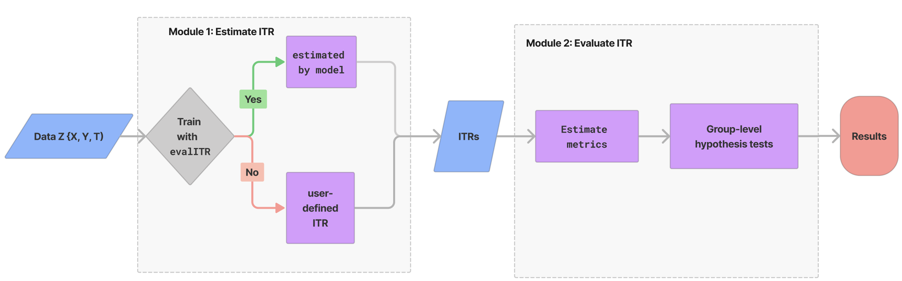

<!-- README.md is generated from README.Rmd. Please edit that file -->



# evalITR

<!-- badges: start -->
<!-- badges: end -->

## Installation

You can install the development version of evalITR from
[GitHub](https://github.com/) with:

``` r
# install.packages("devtools")
devtools::install_github("MichaelLLi/evalITR")
```

(Optional) if you have multiple cores, we recommendate using
multisession futures and processing in parallel. This would increase
computation efficiency and reduce the time to fit the model.

``` r
library(furrr)
library(future.apply)

nworkers <- 4
plan(multisession, workers =nworkers)
```

## Example under sample splitting

This is an example using the `star` dataset (for more information about
the dataset, please use `?star`).

We start with a simple example with one outcome variable (writing
scores) and one machine learning algorithm (causal forest). Then we move
to incoporate multiple outcomes and compare model performances with
several machine learning algorithms.

To begin, we load the dataset and specify the outcome variable and
covariates to be used in the model. Next, we utilize a random forest
algorithm to develop an Individualized Treatment Rule (ITR) for
estimating the varied impacts of small class sizes on students’ writing
scores. Since the treatment is often costly for most policy programs, we
consider a case with 20% budget constraint (`budget` = 0.2). The model
will identify the top 20% of units who benefit from the treatment most
and assign them to with the treatment. We train the model through sample
splitting, with the `ratio` between the train and test sets determined
by the ratio argument. Specifically, we allocate 70% of the data to
train the model, while the remaining 30% is used as testing data
(`ratio` = 0.7).

``` r
library(tidyverse)
library(evalITR)

load("data/star.rda")

# specifying the outcome
outcomes <- "g3tlangss"

# specifying the treatment
treatment <- "treatment"

# specifying covariates
covariates <-  star %>% dplyr::select(-c("g3tlangss",
                "g3treadss","g3tmathss","treatment")) %>% 
                colnames()

# specifying the data
star_data = star %>% dplyr::select(-c(g3treadss,g3tmathss))

# specifying the formula
user_formula <- as.formula(paste(paste0(outcomes)," ~ ", paste0(covariates, collapse = "+"), " + treatment"))


# estimate ITR 
fit <- estimate_itr(
               treatment = treatment,
               form = user_formula,
               data = star_data,
               algorithms = c("causal_forest"),
               budget = 0.2,
               ratio = 0.7)
#> Evaluate ITR under sample splitting ...


# evaluate ITR 
est <- evaluate_itr(fit)
#> Cannot compute PAPDp
```

Alternatively, we can train the model with the `caret` package (for
further information about `caret`, see
[caret](http://topepo.github.io/caret/index.html)).

``` r
# alternatively (with caret package)

# specify the trainControl method
fitControl <- caret::trainControl(## 10-fold CV
                           method = "repeatedcv",
                           number = 3,
                           ## repeated ten times
                           repeats = 3)

# estimate ITR
fit_caret <- estimate_itr(
               treatment = treatment,
                form = user_formula,
               data = star_data,
               algorithms = c("rf"),
               budget = 0.2,
               ratio = 0.7,
               preProcess = NULL, # pre-processing predictors
               tuneGrid = NULL, # tuning values
               tuneLength = 1, # granularity in tuning
               trControl = fitControl # trainControl method)
                )


est_caret <- evaluate_itr(fit_caret)
```

The`summary()` function displays the following summary statistics: (1)
population average prescriptive effect `PAPE`; (2) population average
prescriptive effect with a budget constraint `PAPEp`; (3) population
average prescriptive effect difference with a budget constraint `PAPDp`.
This quantity will be computed with more than 2 machine learning
algorithms); (4) and area under the prescriptive effect curve `AUPEC`.
For more information about these evaluation metrics, please refer to
[Imai and Li (2021)](https://arxiv.org/abs/1905.05389); (5) Grouped
Average Treatment Effects `GATEs`. The details of the methods for this
design are given in [Imai and Li
(2022)](https://arxiv.org/abs/2203.14511).

``` r
# summarize estimates
summary(est)
#> ── PAPE ────────────────────────────────────────────────────────────────────────
#>   estimate std.deviation     algorithm statistic p.value
#> 1    -0.44           1.1 causal_forest     -0.42    0.67
#> 
#> ── PAPEp ───────────────────────────────────────────────────────────────────────
#>   estimate std.deviation     algorithm statistic p.value
#> 1      3.6           1.3 causal_forest       2.7  0.0061
#> 
#> ── PAPDp ───────────────────────────────────────────────────────────────────────
#> data frame with 0 columns and 0 rows
#> 
#> ── AUPEC ───────────────────────────────────────────────────────────────────────
#>   estimate std.deviation     algorithm statistic p.value
#> 1      2.5          0.97 causal_forest       2.6    0.01
#> 
#> ── GATE ────────────────────────────────────────────────────────────────────────
#>   estimate std.deviation     algorithm group statistic p.value upper lower
#> 1     -9.6           109 causal_forest     1    -0.088    0.93  -176   182
#> 2    -20.4           108 causal_forest     2    -0.188    0.85  -175   181
#> 3    -36.4           110 causal_forest     3    -0.332    0.74  -177   183
#> 4     -9.8           107 causal_forest     4    -0.092    0.93  -174   179
#> 5     89.8           109 causal_forest     5     0.823    0.41  -177   182

# summarize estimates with model trained using caret
# summary(est_caret)
```

We plot the estimated Area Under the Prescriptive Effect Curve for the
writing score across a range of budget constraints for causal forest.

``` r
# plot the AUPEC 
plot(est)
```


``` r

# plot the AUPEC for the model trained using caret
# plot(est_caret)
```

## Example under cross-validation

The package also allows estimate ITR with k-folds cross-validation.
Instead of specifying the `ratio` argument, we choose the number of
folds (`n_folds`). The following code presents an example of estimating
ITR with 3 folds cross-validation. In practice, we recommend using 10
folds to get a more stable model performance.

``` r
# estimate ITR 
set.seed(2021)
fit_cv <- estimate_itr(
               treatment = treatment,
               form = user_formula,
               data = star_data,
               trcontrol = fitControl,
               algorithms = c("causal_forest"),
               budget = 0.2,
               n_folds = 3)
#> Evaluate ITR with cross-validation ...

# evaluate ITR 
est_cv <- evaluate_itr(fit_cv)
#> Cannot compute PAPDp

# summarize estimates
summary(est_cv)
#> ── PAPE ────────────────────────────────────────────────────────────────────────
#>   estimate std.deviation     algorithm statistic p.value
#> 1     0.49          0.91 causal_forest      0.54    0.59
#> 
#> ── PAPEp ───────────────────────────────────────────────────────────────────────
#>   estimate std.deviation     algorithm statistic p.value
#> 1      2.6          0.76 causal_forest       3.4   6e-04
#> 
#> ── PAPDp ───────────────────────────────────────────────────────────────────────
#> data frame with 0 columns and 0 rows
#> 
#> ── AUPEC ───────────────────────────────────────────────────────────────────────
#>   estimate std.deviation     algorithm statistic p.value
#> 1      1.2           1.5 causal_forest      0.81    0.42
#> 
#> ── GATE ────────────────────────────────────────────────────────────────────────
#>   estimate std.deviation     algorithm group statistic p.value upper lower
#> 1      -85            59 causal_forest     1     -1.45    0.15   -93   101
#> 2       40            59 causal_forest     2      0.68    0.50   -94   101
#> 3       29            59 causal_forest     3      0.50    0.62   -93   101
#> 4       13            59 causal_forest     4      0.22    0.82   -94   101
#> 5       21           102 causal_forest     5      0.20    0.84  -164   171

# plot the AUPEC 
plot(est_cv)
```

<!-- -->

## Example with multiple ML algorithms

We can estimate ITR with various machine learning algorithms and then
compare the performance of each model. The package includes all ML
algorithms in the `caret` package and 2 additional algorithms ([causal
forest](https://grf-labs.github.io/grf/reference/causal_forest.html) and
[bartCause](https://cran.r-project.org/web/packages/bartCause/index.html)).

The package also allows estimate heterogeneous treatment effects on the
individual and group-level. On the individual-level, the summary
statistics and the AUPEC plot show whether assigning individualized
treatment rules may outperform complete random experiment. On the
group-level, we specify the number of groups through `ngates` and
estimating heterogeneous treatment effects across groups.

``` r
# specify the trainControl method
fitControl <- caret::trainControl(## 10-fold CV
                           method = "repeatedcv",
                           number = 3,
                           ## repeated ten times
                           repeats = 3)
# estimate ITR
set.seed(2021)
fit_cv <- estimate_itr(
               treatment = "treatment",
               form = user_formula,
               data = star_data,
               trcontrol = fitControl,
               algorithms = c(
                  "causal_forest", 
                  "bartc",
                  "lasso",
                  "rf"), # from caret package
               budget = 0.2,
               n_folds = 3)
#> Evaluate ITR with cross-validation ...
#> fitting treatment model via method 'bart'
#> fitting response model via method 'bart'
#> fitting treatment model via method 'bart'
#> fitting response model via method 'bart'
#> fitting treatment model via method 'bart'
#> fitting response model via method 'bart'

# evaluate ITR
est_cv <- evaluate_itr(fit_cv)

# summarize estimates
summary(est_cv)
#> ── PAPE ────────────────────────────────────────────────────────────────────────
#>   estimate std.deviation     algorithm statistic p.value
#> 1     0.55          0.73 causal_forest      0.75   0.452
#> 2    -0.34          0.31         bartc     -1.10   0.272
#> 3     0.17          1.07         lasso      0.16   0.871
#> 4     1.41          0.80            rf      1.76   0.078
#> 
#> ── PAPEp ───────────────────────────────────────────────────────────────────────
#>   estimate std.deviation     algorithm statistic p.value
#> 1      2.4          0.65 causal_forest      3.63 0.00029
#> 2      2.0          0.82         bartc      2.41 0.01579
#> 3     -0.2          0.63         lasso     -0.33 0.74490
#> 4      1.2          0.67            rf      1.77 0.07603
#> 
#> ── PAPDp ───────────────────────────────────────────────────────────────────────
#>   estimate std.deviation             algorithm statistic p.value
#> 1     0.38          0.68 causal_forest x bartc      0.56  0.5777
#> 2     2.56          0.81 causal_forest x lasso      3.18  0.0015
#> 3     1.16          0.67    causal_forest x rf      1.73  0.0844
#> 4     2.18          1.13         bartc x lasso      1.92  0.0543
#> 5     0.78          0.85            bartc x rf      0.93  0.3539
#> 6    -1.40          0.81            lasso x rf     -1.73  0.0837
#> 
#> ── AUPEC ───────────────────────────────────────────────────────────────────────
#>   estimate std.deviation     algorithm statistic p.value
#> 1     1.23           1.5 causal_forest      0.80    0.43
#> 2     0.67           1.3         bartc      0.51    0.61
#> 3     0.18           1.4         lasso      0.13    0.90
#> 4     0.81           1.6            rf      0.51    0.61
#> 
#> ── GATE ────────────────────────────────────────────────────────────────────────
#>    estimate std.deviation     algorithm group statistic p.value upper lower
#> 1     -98.6            59 causal_forest     1    -1.676   0.094   -93   100
#> 2      54.8            60 causal_forest     2     0.921   0.357   -94   102
#> 3      26.6            59 causal_forest     3     0.452   0.651   -93   100
#> 4      -4.2            75 causal_forest     4    -0.056   0.955  -120   127
#> 5      39.6           102 causal_forest     5     0.389   0.698  -164   171
#> 6      55.5            86         bartc     1     0.645   0.519  -138   145
#> 7    -192.6            75         bartc     2    -2.554   0.011  -120   128
#> 8      38.2            86         bartc     3     0.445   0.656  -138   145
#> 9      65.7            83         bartc     4     0.796   0.426  -132   139
#> 10     51.4            89         bartc     5     0.577   0.564  -143   150
#> 11    -14.4            94         lasso     1    -0.154   0.878  -150   158
#> 12    -87.3            88         lasso     2    -0.994   0.320  -141   148
#> 13     80.7            98         lasso     3     0.825   0.409  -157   165
#> 14     12.6            59         lasso     4     0.214   0.830   -93   100
#> 15     26.6            59         lasso     5     0.451   0.652   -93   101
#> 16    -26.6            59            rf     1    -0.450   0.653   -93   101
#> 17    -35.8            79            rf     2    -0.454   0.649  -126   133
#> 18     18.4            99            rf     3     0.186   0.852  -159   167
#> 19     28.1            59            rf     4     0.479   0.632   -93   100
#> 20     34.0            59            rf     5     0.572   0.567   -94   102
```

We plot the estimated Area Under the Prescriptive Effect Curve for the
writing score across different ML algorithms.

``` r
# plot the AUPEC with different ML algorithms
plot(est_cv)
```


For caret models, we can extract the training model and check the model
performance.

``` r
# extract the caret model
fit$estimates$models$rf %>% 
  ggplot() + theme_bw() 
```


