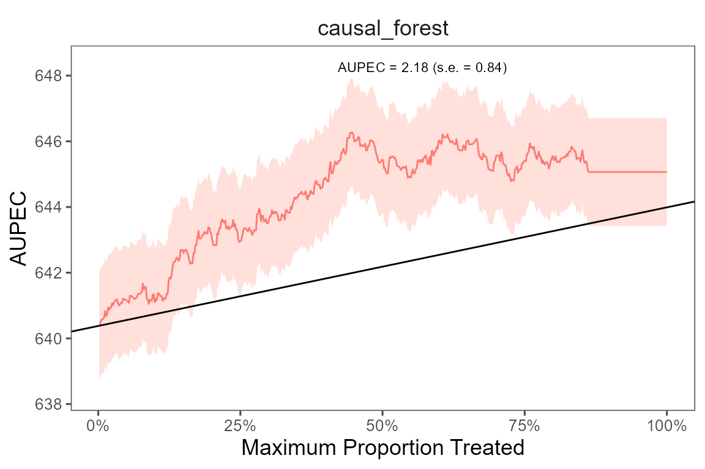

<!-- README.md is generated from README.Rmd. Please edit that file -->

# evalITR

<!-- badges: start -->
<!-- badges: end -->

## Installation

You can install the development version of evalITR from
[GitHub](https://github.com/) with:

``` r
# install.packages("devtools")
devtools::install_github("MichaelLLi/evalITR")
```

(Optional) if you have multiple cores, we recommendate using
multisession futures and processing in parallel. This would increase
computation efficiency and reduce the time to fit the model.

``` r
library(furrr)
library(future.apply)

nworkers <- 4
plan(multisession, workers =nworkers)
```

## Example under sample splitting

This is an example using the `star` dataset (for more information about
the dataset, please use `?star`).

We start with a simple example with one outcome variable (writing
scores) and one machine learning algorithm (causal forest). Then we move
to incoporate multiple outcomes and compare model performances with
several machine learning algorithms.

To begin, we load the dataset and specify the outcome variable and
covariates to be used in the model. Next, we utilize a random forest
algorithm to develop an Individualized Treatment Rule (ITR) for
estimating the varied impacts of small class sizes on students’ writing
scores. Since the treatment is often costly for most policy programs, we
consider a case with 20% budget constraint (`plim` = 0.2). The model
will identify the top 20% of units who benefit from the treatment most
and assign them to with the treatment. We train the model through sample
splitting, with the `ratio` between the train and test sets determined
by the ratio argument. Specifically, we allocate 70% of the data to
train the model, while the remaining 30% is used as testing data (ratio
= 0.7).

``` r
library(tidyverse)
library(evalITR)

load("data/star.rda")

# specifying the outcome
outcomes <- "g3tlangss"

# specifying the treatment
treatment <- "treatment"

# specifying covariates
covariates <-  star %>% dplyr::select(-c("g3tlangss",
                "g3treadss","g3tmathss","treatment")) %>% 
                colnames()

# estimate ITR 
fit <- run_itr(outcome = outcomes,
               treatment = treatment,
               covariates = covariates,
               data = star,
               algorithms = c("causal_forest"),
               plim = 0.2,
               ratio = 0.7)
#> Evaluate ITR under sample splitting ...

# evaluate ITR 
est <- estimate_itr(fit)
#> Cannot compute PAPDp
```

The`summary()` function displays the following summary statistics: (1)
population average prescriptive effect `PAPE`; (2) population average
prescriptive effect with a budget constraint `PAPEp`; (3) population
average prescriptive effect difference with a budget constraint `PAPDp`.
This quantity will be computed with more than 2 machine learning
algorithms); (4) and area under the prescriptive effect curve `AUPEC`.
For more information about these evaluation metrics, please refer to
[Imai and Li (2021)](https://arxiv.org/abs/1905.05389); (5) Grouped
Average Treatment Effects `GATEs`. The details of the methods for this
design are given in [Imai and Li
(2022)](https://arxiv.org/abs/2203.14511).

``` r
# summarize estimates
summary(est)
#> ── PAPE ────────────────────────────────────────────────────────────────────────
#>   estimate std.deviation     algorithm statistic p.value
#> 1      1.6           1.3 causal_forest       1.2    0.24
#> 
#> ── PAPEp ───────────────────────────────────────────────────────────────────────
#>   estimate std.deviation     algorithm statistic p.value
#> 1     0.85           1.2 causal_forest      0.72    0.47
#> 
#> ── PAPDp ───────────────────────────────────────────────────────────────────────
#> data frame with 0 columns and 0 rows
#> 
#> ── AUPEC ───────────────────────────────────────────────────────────────────────
#>   estimate std.deviation     algorithm statistic p.value
#> 1     0.99             1 causal_forest      0.98    0.33
#> 
#> ── GATE ────────────────────────────────────────────────────────────────────────
#>   estimate std.deviation     algorithm group statistic p.value upper lower
#> 1     -102           108 causal_forest     1     -0.95    0.34  -170   184
#> 2      -53           107 causal_forest     2     -0.50    0.62  -169   183
#> 3      124           109 causal_forest     3      1.14    0.25  -172   186
#> 4      147           108 causal_forest     4      1.36    0.17  -171   185
#> 5      -81           106 causal_forest     5     -0.76    0.45  -168   182
```

We plot the estimated Area Under the Prescriptive Effect Curve for the
writing score across a range of budget constraints for causal forest.

``` r
# plot the AUPEC 
plot(est)
```



## Example under cross-validation

The package also allows estimate ITR with k-folds cross-validation.
Instead of specifying the `ratio` argument, we choose the number of
folds (`n_folds`). The following code presents an example of estimating
ITR with 3 folds cross-validation. In practice, we recommend using 10
folds to get a more stable model performance.

``` r
# estimate ITR 
fit_cv <- run_itr(outcome = outcomes,
               treatment = treatment,
               covariates = covariates,
               data = star,
               algorithms = c("causal_forest"),
               plim = 0.2,
               n_folds = 3)
#> Evaluate ITR with cross-validation ...

# evaluate ITR 
est_cv <- estimate_itr(fit_cv)
#> Cannot compute PAPDp
```

We present the results with 3-folds cross validation and plot the AUPEC.

``` r
# summarize estimates
summary(est_cv)
#> ── PAPE ────────────────────────────────────────────────────────────────────────
#>   estimate std.deviation     algorithm statistic p.value
#> 1      1.3          0.69 causal_forest       1.8   0.068
#> 
#> ── PAPEp ───────────────────────────────────────────────────────────────────────
#>   estimate std.deviation     algorithm statistic p.value
#> 1      2.2          0.97 causal_forest       2.3   0.021
#> 
#> ── PAPDp ───────────────────────────────────────────────────────────────────────
#> data frame with 0 columns and 0 rows
#> 
#> ── AUPEC ───────────────────────────────────────────────────────────────────────
#>   estimate std.deviation     algorithm statistic p.value
#> 1      1.7          0.76 causal_forest       2.3   0.023
#> 
#> ── GATE ────────────────────────────────────────────────────────────────────────
#>   estimate std.deviation     algorithm group statistic p.value upper lower
#> 1      -43            59 causal_forest     1     -0.74    0.46   -93   100
#> 2      104            59 causal_forest     2      1.75    0.08   -94   101
#> 3      -58            59 causal_forest     3     -0.98    0.33   -94   101
#> 4      -36            93 causal_forest     4     -0.39    0.70  -150   157
#> 5       52            59 causal_forest     5      0.89    0.37   -93   100
```

``` r
# plot the AUPEC 
plot(est_cv)
```


## Example with multiple ML algorithms/outcomes

We can estimate ITR with various machine learning algorithms and then
compare the performance of each model. The package includes 8 different
ML algorithms (causal forest, BART, lasso, boosting trees, random
forest, CART, bagging trees, svm).

The package also allows estimate heterogeneous treatment effects on the
individual and group-level. On the individual-level, the summary
statistics and the AUPEC plot show whether assigning individualized
treatment rules may outperform complete random experiment. On the
group-level, we specify the number of groups through `ngates` and
estimating heterogeneous treatment effects across groups.

If the original experiment has diverse outcome measures, we develop ITRs
for each outcome and use them to estimate the heterogeneous effects
across the different outcomes.

``` r
# specifying outcomes
outcomes <- c("g3tlangss","g3treadss","g3tmathss")

# specifying covariates
covariates <-  star %>% dplyr::select(-c("g3tlangss","g3treadss","g3tmathss","treatment")) %>% colnames()

# train the model
fit_cv <- run_itr(outcome = outcomes,
               treatment = "treatment",
               covariates = covariates,
               data = star,
               algorithms = c(
                  "causal_forest", 
                  # "bartc",
                  # "svm",
                  "lasso",
                  "boost", 
                  "random_forest",
                  "cart",
                  "bagging"),
               plim = 0.2,
               n_folds = 3)
#> Evaluate ITR with cross-validation ...Evaluate ITR with cross-validation ...Evaluate ITR with cross-validation ...
```

``` r
# compute estimates
est_cv <- estimate_itr(fit_cv)
```

``` r
# summarize estimates
summary(est_cv, outcome = "g3tlangss")
#> ── PAPE ────────────────────────────────────────────────────────────────────────
#>   estimate std.deviation     algorithm statistic p.value
#> 1      2.0          1.31 causal_forest      1.56  0.1186
#> 2      0.2          0.75         lasso      0.27  0.7906
#> 3      2.3          0.85         boost      2.67  0.0076
#> 4      2.4          1.30 random_forest      1.83  0.0679
#> 5     -0.4          1.25          cart     -0.32  0.7499
#> 6      1.5          1.13       bagging      1.29  0.1986
#> 
#> ── PAPEp ───────────────────────────────────────────────────────────────────────
#>   estimate std.deviation     algorithm statistic p.value
#> 1    2.922          1.05 causal_forest     2.787  0.0053
#> 2   -0.025          0.73         lasso    -0.034  0.9729
#> 3    1.112          1.06         boost     1.054  0.2920
#> 4    2.437          0.81 random_forest     3.002  0.0027
#> 5    0.386          1.15          cart     0.337  0.7365
#> 6    1.280          0.70       bagging     1.824  0.0682
#> 
#> ── PAPDp ───────────────────────────────────────────────────────────────────────
#>    estimate std.deviation                     algorithm statistic p.value
#> 1      2.95          0.76         causal_forest x lasso      3.87 0.00011
#> 2      1.81          1.27         causal_forest x boost      1.43 0.15315
#> 3      0.49          1.02 causal_forest x random_forest      0.48 0.63450
#> 4      2.54          1.53          causal_forest x cart      1.66 0.09656
#> 5      1.64          0.77       causal_forest x bagging      2.13 0.03301
#> 6     -1.14          0.68                 lasso x boost     -1.66 0.09677
#> 7     -2.46          0.78         lasso x random_forest     -3.15 0.00161
#> 8     -0.41          1.27                  lasso x cart     -0.32 0.74722
#> 9     -1.30          1.38               lasso x bagging     -0.95 0.34444
#> 10    -1.33          1.15         boost x random_forest     -1.15 0.24910
#> 11     0.73          1.58                  boost x cart      0.46 0.64535
#> 12    -0.17          0.72               boost x bagging     -0.23 0.81472
#> 13     2.05          1.38          random_forest x cart      1.48 0.13859
#> 14     1.16          0.52       random_forest x bagging      2.21 0.02690
#> 15    -0.89          1.18                cart x bagging     -0.76 0.44894
#> 
#> ── AUPEC ───────────────────────────────────────────────────────────────────────
#>   estimate std.deviation     algorithm statistic p.value
#> 1     1.96           1.9 causal_forest      1.05    0.29
#> 2     0.45           1.4         lasso      0.32    0.75
#> 3     1.54           2.0         boost      0.78    0.43
#> 4     1.52           1.7 random_forest      0.91    0.36
#> 5    -0.66           1.5          cart     -0.44    0.66
#> 6     0.80           1.7       bagging      0.49    0.63
#> 
#> ── GATE ────────────────────────────────────────────────────────────────────────
#>    estimate std.deviation     algorithm group statistic p.value upper lower
#> 1     -5.02            76 causal_forest     1   -0.0657    0.95  -122   129
#> 2    -75.44            84 causal_forest     2   -0.8972    0.37  -135   142
#> 3     11.96           100 causal_forest     3    0.1201    0.90  -160   167
#> 4     30.93            59 causal_forest     4    0.5229    0.60   -94   101
#> 5     55.55            59 causal_forest     5    0.9487    0.34   -93   100
#> 6      0.36            59         lasso     1    0.0061    1.00   -94   101
#> 7    -31.02            69         lasso     2   -0.4521    0.65  -109   116
#> 8     13.29           100         lasso     3    0.1323    0.89  -162   169
#> 9     61.81           100         lasso     4    0.6178    0.54  -161   168
#> 10   -26.46            81         lasso     5   -0.3273    0.74  -129   137
#> 11   -68.58            85         boost     1   -0.8087    0.42  -136   143
#> 12    -3.66            92         boost     2   -0.0397    0.97  -148   155
#> 13    -2.06            87         boost     3   -0.0235    0.98  -140   147
#> 14    45.29            59         boost     4    0.7623    0.45   -94   101
#> 15    46.98           100         boost     5    0.4677    0.64  -162   169
#> 16   -49.71            59 random_forest     1   -0.8397    0.40   -94   101
#> 17    32.91            59 random_forest     2    0.5594    0.58   -93   100
#> 18   -14.34            84 random_forest     3   -0.1705    0.86  -135   142
#> 19     3.19            85 random_forest     4    0.0376    0.97  -136   143
#> 20    45.94            79 random_forest     5    0.5809    0.56  -126   134
#> 21   -39.93            94          cart     1   -0.4265    0.67  -150   158
#> 22    17.30            59          cart     2    0.2930    0.77   -94   101
#> 23    45.22            59          cart     3    0.7671    0.44   -93   101
#> 24    40.16            69          cart     4    0.5850    0.56  -109   117
#> 25   -44.77            59          cart     5   -0.7599    0.45   -93   100
#> 26   -75.90            98       bagging     1   -0.7717    0.44  -158   165
#> 27    -8.66            75       bagging     2   -0.1158    0.91  -119   127
#> 28    73.38            72       bagging     3    1.0126    0.31  -116   123
#> 29   -31.77            98       bagging     4   -0.3242    0.75  -158   165
#> 30    60.93            82       bagging     5    0.7448    0.46  -131   138
```

We plot the estimated Area Under the Prescriptive Effect Curve for the
writing score across different ML algorithms.

``` r
# plot the AUPEC with different ML algorithms
plot(est_cv, outcome = "g3tlangss")
```


